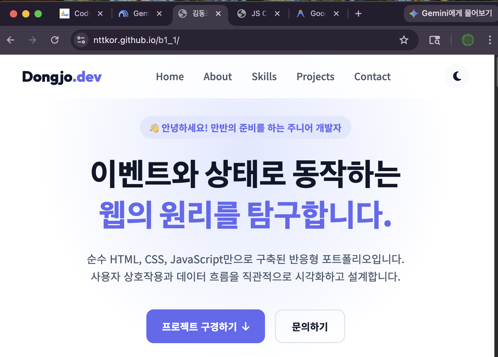
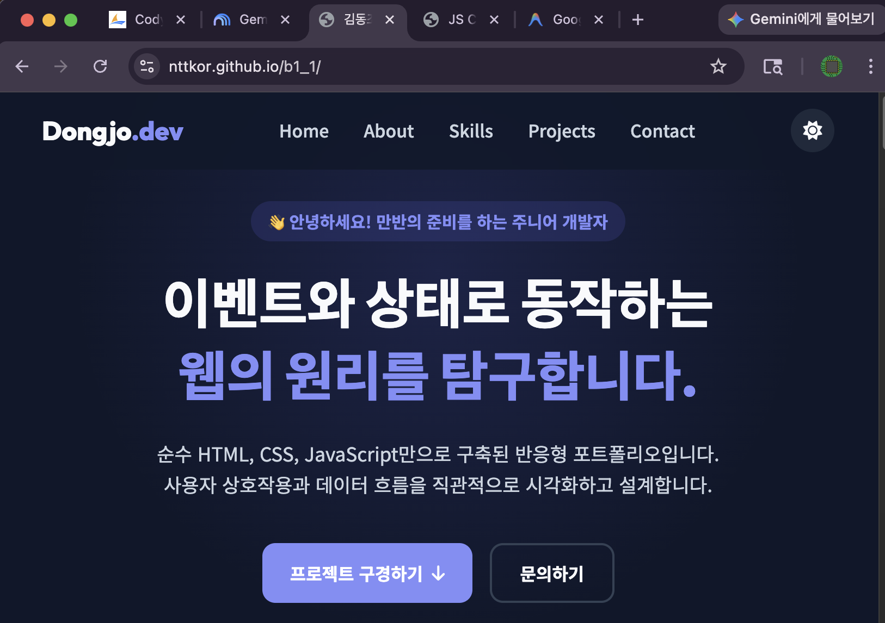
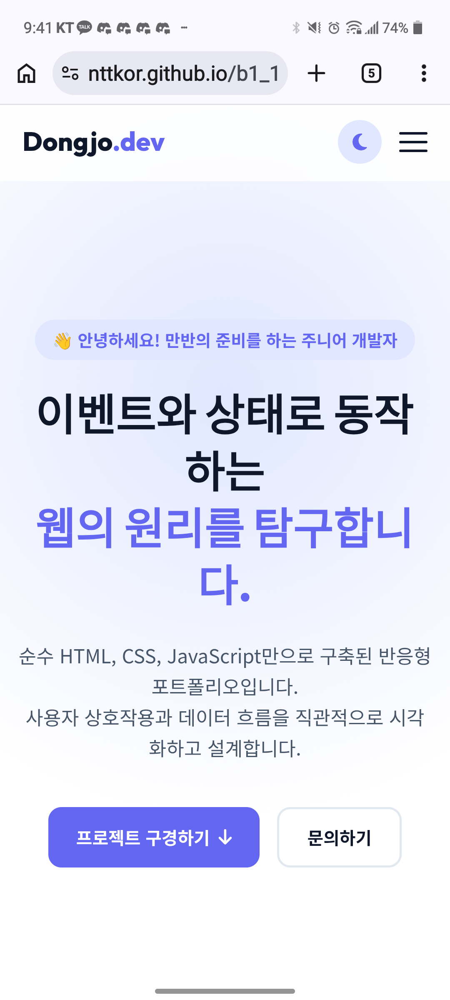
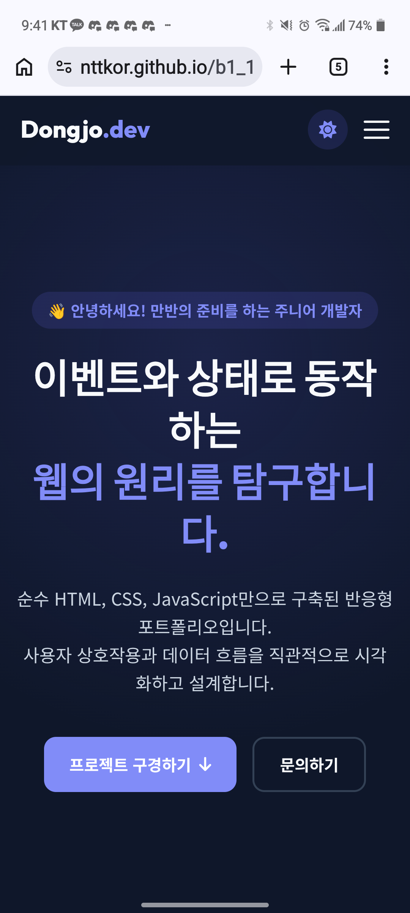
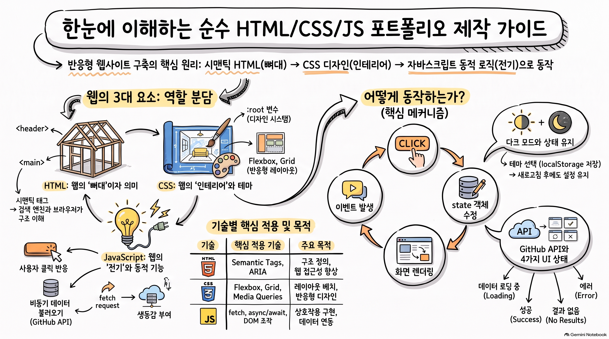
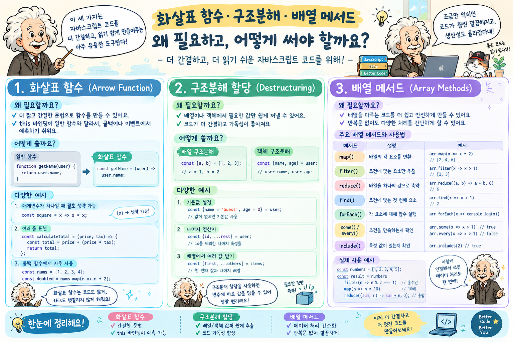
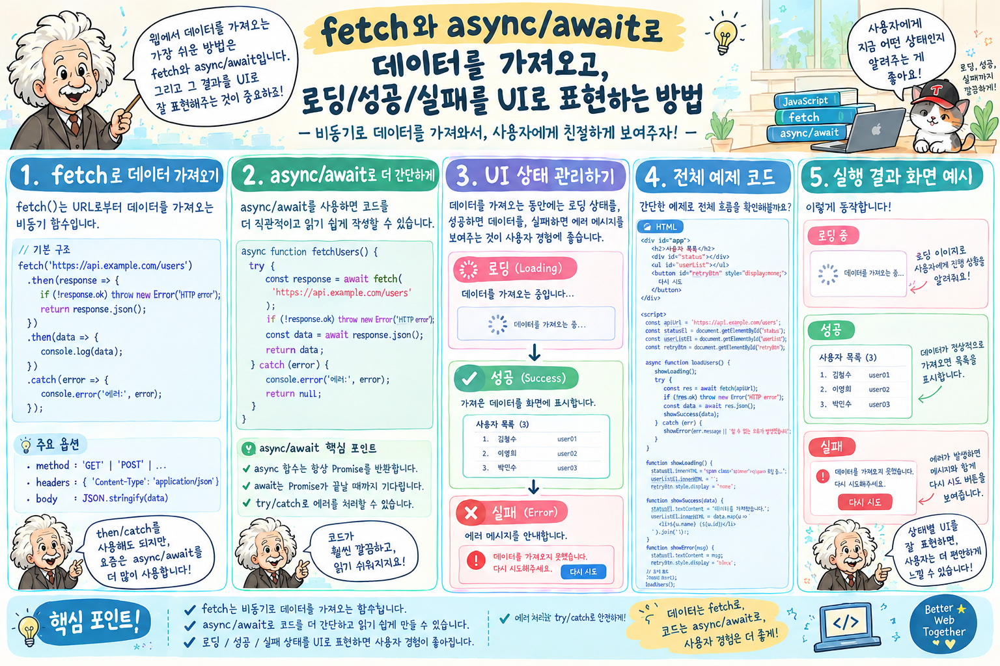
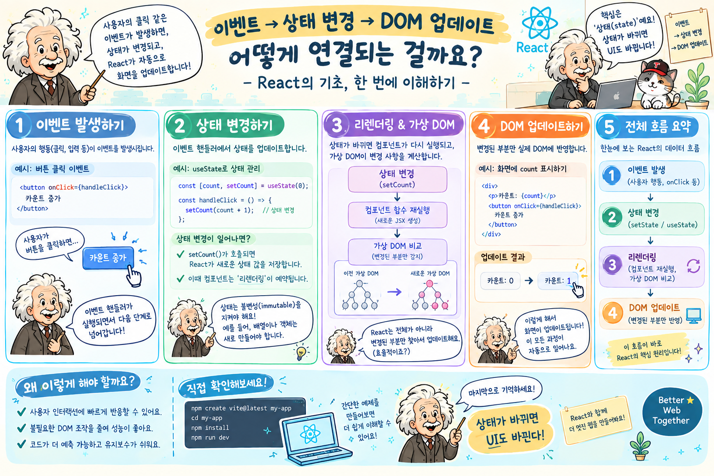

# 🌐 B1-1 나를 소개하는 반응형 포트폴리오 웹사이트

> 순수 **HTML5, CSS3, JavaScript(ES6+)**만으로 개발한 반응형 포트폴리오 웹사이트입니다.  
> 외부 라이브러리/프레임워크(React, Vue, Bootstrap, Tailwind 등) 없이 **"사용자 이벤트 → 상태(State) 변경 → DOM 렌더링"** 흐름을 직접 구축했습니다.

---

## 📌 1. 프로젝트 기본 정보

- **개발자**: 김동조 (nttkor)
- **학습 단계**: AI/SW 기초 (웹 기초와 프론트엔드)
- **저장소 URL**: [https://github.com/nttkor/b1_1](https://github.com/nttkor/b1_1)
- **배포 URL**: [https://nttkor.github.io/b1_1/](https://nttkor.github.io/b1_1/)
- **개발 환경**: VS Code + Live Server + Vanilla JS + Git/GitHub Pages

---

## 📸 2. 스크린샷

| 데스크톱 (라이트 모드) | 데스크톱 (다크 모드) |
| :---: | :---: |
|  |  |

| 모바일 (라이트 모드) | 모바일 (다크 모드) |
| :---: | :---: |
|  |  |

---

## 🛠 3. 사용 기술

| 분류 | 기술 | 적용 위치 |
| :--- | :--- | :--- |
| 구조 | HTML5 (시맨틱 태그) | [index.html](index.html) — header/nav/main/section/article/footer |
| 스타일 | CSS3 (변수, Flexbox, Grid, 미디어 쿼리) | [css/style.css](css/style.css) |
| 동작 | JavaScript ES6+ (async/await, 구조분해, 배열 메서드) | [js/app.js](js/app.js) |
| API | GitHub REST API | `fetch` → `api.github.com/users/nttkor/repos` |
| 저장소 | localStorage | 다크모드 설정 새로고침 유지 |
| 배포 | GitHub Pages | `nttkor.github.io/b1_1/` |
| 폰트·아이콘 | Google Fonts, Font Awesome | CDN (외부 라이브러리 미사용 원칙 준수) |

---

## 🎓 4. 과제 목표 — 6가지 핵심 개념 설명

> 미션 §3 "학습자는 아래를 스스로 설명할 수 있어야 한다" 에 대한 답변입니다.



### Q1. HTML 시맨틱 태그의 사용 이유와 본인만의 구조 설계 기준

> 편 소스: [index.html](index.html) | GitHub: [`index.html`](https://github.com/nttkor/b1_1/blob/main/index.html) | 상세 설명: [doc/study.md#semantic](doc/study.md#semantic)


- **시맨틱 태그(Semantic Tag)를 사용하는 이유**:
  - `<div>`와 `<span>` 같은 무의미한(Non-semantic) 태그만 사용하면 브라우저, 검색엔진, 스크린 리더가 각 영역의 기능과 위계를 파악할 수 없습니다.
  - **검색엔진 최적화(SEO)**: 검색엔진 로봇이 `<header>`, `<main>`, `<article>` 등의 구조를 바탕으로 핵심 콘텐츠의 우선순위를 정확히 색인합니다.
  - **웹 접근성(A11y)**: 스크린 리더 사용자가 랜드마크(Header, Nav, Main, Footer) 간을 단축키로 빠르게 건너뛰며 웹페이지를 탐색할 수 있습니다.
  - **유지보수성 및 가독성**: 코드만 보고도 해당 구역이 네비게이션인지, 본문인지, 독립 기사인지 직관적으로 이해할 수 있습니다.

- **본 프로젝트의 시맨틱 구조 설계 기준**:
  1. `<header>` & `<nav>`: 사이트 최상단 고정 영역으로, 브랜드 로고와 5대 섹션 이동 링크를 담아 네비게이션 역할을 명확히 규정.
  2. `<main>`: 문서 전체에서 고유하며 반복되지 않는 핵심 주제 콘텐츠 영역 전체를 포괄.
  3. `<section>`: 연관된 주제별 독립 블록 단위(`Hero`, `About`, `Skills`, `Projects`, `Contact`)를 논리적으로 구분. 각 섹션은 고유한 `id`와 제목(`<h2>`)을 포함.
  4. `<article>`: `Skills` 섹션의 각 기술 스택 카드 및 `Projects` 섹션의 GitHub 저장소 카드는 그 자체로 독립적으로 배포되거나 재사용 가능한 단위이므로 `<article>`로 구조화.
  5. `<footer>`: 페이지 최하단 영역으로, 저작권 표기 및 외부 프로필(GitHub, LinkedIn) 링크를 배치.

### Q2. CSS Flexbox와 Grid의 차이점 및 상황별 선택 기준

> 편 소스: [css/style.css](css/style.css) | GitHub: [`css/style.css`](https://github.com/nttkor/b1_1/blob/main/css/style.css) | 상세 설명: [doc/study.md#layout](doc/study.md#layout)


- **Flexbox vs Grid 핵심 차이점 비교**:

| 비교 항목 | Flexbox (1차원) | Grid (2차원) |
| :--- | :--- | :--- |
| **차원** | **1차원** (가로(row) 또는 세로(column) 단일 축) | **2차원** (가로행(row)과 세로열(column) 동시 통제) |
| **설계 철학** | 콘텐츠 중심 (Content-first): 내부 아이템 크기와 정렬 | 레이아웃 중심 (Layout-first): 전체 격자 틀을 먼저 정의 |
| **적용 영역** | 헤더 네비게이션, 버튼 그룹, 카드 내부 인라인 정렬 | 포트폴리오 카드 그리드, 대시보드 레이아웃 |
| **핵심 속성** | `display: flex; justify-content; align-items;` | `display: grid; grid-template-columns; gap;` |

- **상황별 선택 기준 및 실제 적용**:
  - **Flexbox 선택 (`.nav-container`)**:
    - 로고는 왼쪽, 메뉴 링크는 오른쪽으로 1차원 수평 정렬하고 수직 중앙을 맞출 때(`justify-content: space-between; align-items: center;`) 가장 직관적이고 유연하므로 Navigation에 채택했습니다.
  - **Grid 선택 (`.projects-grid`)**:
    - GitHub 저장소 카드들을 2차원 격자 형태로 배치할 때, `grid-template-columns: repeat(auto-fit, minmax(280px, 1fr));`를 사용하여 미디어 쿼리를 일일이 쓰지 않고도 화면 너비에 따라 열 수가 자동으로 늘어나거나 줄어드는 유연한 반응형 레이아웃을 구현하기 위해 Grid를 채택했습니다.

```css
/* Flexbox: 1차원 수평 정렬 (로고 왼쪽 ↔ 메뉴 오른쪽) */
.nav-container {
  display: flex;
  justify-content: space-between;
  align-items: center;
}

/* Grid: 2차원 자동 반응형 격자 (카드가 화면에 맞춰 자동 배치) */
.projects-grid {
  display: grid;
  grid-template-columns: repeat(auto-fit, minmax(280px, 1fr));
  gap: 1.5rem;
}
```

### Q3. querySelector로 DOM을 선택하고, addEventListener로 이벤트를 연결하는 흐름

> 편 소스: [js/app.js](js/app.js) | GitHub: [`js/app.js L1~70`](https://github.com/nttkor/b1_1/blob/main/js/app.js#L1-L70) | 상세 설명: [doc/study.md#event-state-render](doc/study.md#event-state-render)


**찾기 → 모으기 → 등록** 세 단계로 구성했습니다.

1. **찾기 (Select)**: `querySelector`를 사용해 CSS 선택자(ID `#`, 클래스 `.`)로 원하는 DOM 요소를 탐색합니다.
2. **모으기 (Collect & Cache)**: 탐색한 요소를 `elements` 객체에 한 번만 모아 캐싱함으로써, 불필요한 반복 탐색(DOM Re-querying)을 방지합니다.
3. **등록 (Register & Bind)**: HTML `onclick` 대신 `addEventListener`를 사용하여 관심사(구조와 로직)를 분리하고, 요소 존재 여부를 확인(`if`)하여 안전하게 이벤트를 연결합니다.

```javascript
{
  // 1. 찾기 & 2. 모으기: querySelectorAll로 페이지의 모든 버튼 선택
  const elements = {
    buttons: document.querySelectorAll('button')
  };

  // 3. 등록: 어떤 버튼을 누르든 해당 버튼의 ID 이름 표시
  elements.buttons.forEach(btn => {
    btn.addEventListener('click', () => {
      console.log(`클릭된 버튼 ID: ${btn.id || '(ID 없음)'}`);
    });
  });
}
```

### Q4. 화살표 함수, 구조분해 할당, 배열 메서드(map/filter)의 필요성과 활용

> 편 소스: [js/app.js](js/app.js) | GitHub: [`js/app.js L126~243`](https://github.com/nttkor/b1_1/blob/main/js/app.js#L126-L243) | 상세 설명: [doc/study.md#single-source](doc/study.md#single-source)



- **1. 화살표 함수 (Arrow Function)**:
  - **필요성**: 기존 `function` 키워드 대비 문법이 간결하며, 자신만의 `this`를 바인딩하지 않고 상위 렉시컬 스코프의 `this`를 유지하여 콜백 함수나 이벤트 핸들러 작성 시 `bind`나 임시 변수(`const self = this;`)를 쓸 필요가 없습니다.
  - **활용**: 테마 전환(`renderTheme`), 메뉴 렌더링(`renderMenu`), 이벤트 콜백 함수 작성에 전면 활용.
- **2. 구조분해 할당 (Destructuring Assignment)**:
  - **필요성**: `state.theme`, `repo.name`, `repo.html_url` 등 객체 프로퍼티를 매번 점 표기법으로 반복 작성하는 중복을 줄이고, 필요한 데이터만 한 줄로 직관적으로 추출합니다.
  - **활용**: `const { theme, isMenuOpen } = state;`, `const { name, description, html_url, language } = repo;`
- **3. 템플릿 리터럴 (Template Literals)**:
  - **필요성**: `+` 연산자로 문자열과 변수를 복잡하게 이어붙일 필요 없이, 백틱(`` ` ``)과 `${}` 표현식을 이용해 줄바꿈이 포함된 복합 HTML 구조를 가독성 높게 동적 생성합니다.
  JavaScript에서 **문자열(글자)과 변수를 편하게 이어붙이고, 줄바꿈도 쉽게 쓸 수 있도록 만들어진 문법**입니다.

```javascript
const name = "김동조";
const html = `
  <div class="card">
    <h2>${name}님 안녕하세요</h2>
  </div>
`;
```

---

**한 줄 요약:**
자바스크립트 안에서 HTML 태그나 긴 문장을 동적으로 만들 때, `+` 기호 지옥에서 벗어나 **백틱(```)과 `${}`로 깔끔하게 코드를 작성하는 문법**입니다.
- **4. 배열 메서드 (`map`, `filter`, `forEach`)**:
  - **필요성**: 명령형 `for` 반복문 없이 선언적 코드로 불변성(Immutability)을 유지하며 데이터를 안전하게 가공합니다.
  - **`filter`**: 포크된 저장소를 제외(`!repo.fork`)하거나 특정 언어(`repo.language === targetLang`)만 선별하여 새 배열 생성.
  - **`map`**: 필터링된 저장소 객체 배열을 순회하며 개별 `<article class="project-card">` HTML 문자열 배열로 1:1 변환.
  - **`forEach`**: `navLinks`, `filter-btn` 등 NodeList를 순회하며 개별 요소에 이벤트 리스너를 일괄 바인딩.

```javascript
// ① 구조분해 할당 & 화살표 함수로 필요한 상태값 추출
const renderHeaderState = () => {
  const { isMenuOpen, theme } = state;
  console.log(`현재 테마: ${theme}, 메뉴 열림: ${isMenuOpen}`);
};

// ② filter + map + 템플릿 리터럴을 결합한 카드 UI 동적 생성 (완전한 실행 코드)
const generateCards = (repositories, targetLanguage) => {
  return repositories
    // filter: 포크 저장소 제외 및 선택 언어 필터링
    .filter(repo => !repo.fork && (targetLanguage === 'all' || repo.language === targetLanguage))
    // map: 각 저장소 데이터를 HTML 카드 문자열로 변환 (구조분해 할당 활용)
    .map(({ name, description, html_url, language, stargazers_count }) => `
      <article class="project-card">
        <div class="card-header">
          <h3>${name}</h3>
          <span class="badge">${language || '기타'}</span>
        </div>
        <p>${description || '설명이 없습니다.'}</p>
        <div class="card-footer">
          <span>⭐ ${stargazers_count}</span>
          <a href="${html_url}" target="_blank" rel="noopener noreferrer">GitHub 방문</a>
        </div>
      </article>
    `)
    .join(''); // 배열을 하나의 HTML 문자열로 결합
};
```


### Q5. fetch와 async/await 비동기 데이터 호출 및 4가지 UI 상태 표현

> 편 소스: [js/app.js](js/app.js) | GitHub: [`js/app.js L250~293`](https://github.com/nttkor/b1_1/blob/main/js/app.js#L250-L293) | 상세 설명: [doc/study.md#async](doc/study.md#async)



`idle → loading → success | error | empty` 상태 기반 렌더링으로 사용자 경험(UX)을 완결했습니다.

- **비동기 처리 방식**:
  - `fetch` API와 `async/await`를 사용하여 Promise 체이닝(`.then()`) 대비 동기식 코드처럼 읽기 쉽고 직관적인 비동기 흐름을 구축했습니다.
  - `try / catch / finally` 블록을 구성하여 네트워크 장애나 HTTP 오류(`!response.ok`), GitHub API Rate Limit(403) 초과 상황을 안전하게 예외 처리하고, 결과에 관계없이 `finally`에서 항상 최종 UI를 갱신합니다.
- **4가지 UI 상태 표현**:
  1. **로딩(loading)**: API 호출 직후 스피너 애니메이션과 `"GitHub 프로젝트를 불러오는 중입니다..."` 안내 문구 표시.
  2. **성공(success)**: 정상 응답 데이터를 받아 `map()`을 거쳐 생성된 프로젝트 카드 그리드를 화면에 렌더링.
  3. **에러(error)**: API 제한(403)이나 네트워크 오류 시 `"프로젝트를 불러올 수 없습니다"` 에러 메시지와 함께 수동 재시도 가능한 **`[다시 시도]`** 버튼 노출.
  4. **빈 상태(empty)**: 필터 결과가 없거나 저장소가 0개일 때 `"표시할 프로젝트가 없습니다."` 안내 문구 렌더링.

  비동기 처리의 4가지 핵심 개념(**Promise, fetch, async, await**)을 작동 원리와 실제 예시를 포함해 더욱 깊이 있게 정리해 드립니다.

---

### 1. Promise (약속 객체)

`Promise`는 "비동기 작업의 미래 결과(성공 또는 실패)를 담아두는 상자"입니다.

자바스크립트는 싱글 스레드로 작동하기 때문에, 서버 통신처럼 시간이 걸리는 작업을 할 때 전체 프로그램이 멈추지 않도록 일단 `Promise` 객체를 만들어 반환하고 작업을 백그라운드에서 계속 진행합니다.

* **3가지 상태 (State)**
1. **Pending (대기):** 비동기 작업이 아직 끝나지 않은 상태.
2. **Fulfilled (이행/성공):** 작업이 무사히 끝나 성공 데이터가 상자에 들어간 상태. (`resolve()` 호출)
3. **Rejected (거부/실패):** 네트워크 오류 등으로 작업이 실패하여 에러 정보가 상자에 들어간 상태. (`reject()` 호출)


* **존재 이유:** 옛날 자바스크립트에서 쓰던 '콜백 함수(Callback)' 연속 사용 시 코드 들여쓰기가 끝없이 깊어지는 콜백 지옥(Callback Hell)을 해결하기 위해 도입되었습니다.

---

### 2. `fetch()` API

`fetch`는 **웹 브라우저에 내장된 네트워크 데이터 요청 도구**입니다.

* **동작 원리:** URL을 넘겨받아 서버에 HTTP 요청을 보내고, 그 결과를 담은 **`Promise` 객체를 즉시 반환**합니다.
* **주의할 점 (`fetch`의 특이사항):**
* `fetch`는 서버 응답이 404(Not Found)나 500(Internal Server Error) 같은 에러 상태코드여도 `Promise`를 실패(`Rejected`)로 처리하지 **않습니다**. (네트워크 연결이 아예 끊긴 경우에만 `Rejected` 처리)
* 따라서 코드로 직접 `if (!response.ok)`를 체크해 주는 예외 처리가 필수적입니다.
* 서버에서 넘어온 데이터 본문을 사용하려면 `response.json()`을 호출해야 하며, **이 `json()` 함수 역시 `Promise`를 반환**하므로 한 번 더 기다려야 데이터를 추출할 수 있습니다.

---

### 3. `async` 키워드

`async`는 함수 선언부(예: `async function()` 또는 `const fn = async () => {}`) 앞에 붙이는 **비동기 전용 함수 선언자**입니다.

* **핵심 역할:**
1. **무조건 Promise 반환:** `async`가 붙은 함수 안에서 일반 값(숫자, 문자, 객체 등)을 `return`해도, 자바스크립트가 알아서 해당 값을 성공 결과로 담은 `Promise`로 감싸서 반환합니다.
2. **`await` 사용 권한 부여:** 함수 내부에서 `await` 키워드를 사용할 수 있는 환경을 만들어 줍니다. (`async` 없이는 함수 안에서 `await`를 쓸 수 없음)

---

### 4. `.then()` vs `await` 상세 비교

두 방식 모두 `Promise`의 결과 데이터를 꺼내 쓰는 방법이지만, **작성 스타일과 제어 방식**에서 큰 차이가 있습니다.
#### 차이점 한눈에 보기

  - .then(): "데이터 오면 이 함수 실행해 줘" (알림 예약)
  - await: "데이터 올 때까지 잠시 멈췄다가 이 변수에 바로 담아줘" (직접 대기)

#### ① `.then()` 방식 (Promise Chaining)

1. **방식:** 비동기 작업이 끝났을 때 실행될 콜백 함수를 미리 등록만 해두고 다음 줄로 넘어갑니다.
2. **장점:** 간단한 비동기 작업 한두 개를 처리할 때는 코드가 직관적입니다.
3. **단점:** 연쇄적인 비동기 요청이 늘어나면 `.then().then().then()`으로 계속 이어져 코드 가독성이 떨어지며, 여러 비동기 단계 중 **어디서 에러가 났는지 추적하기가 다소 까다롭습니다.**

```javascript
// .then() 예시
function loadData() {
  fetch('/api/user')
    .then(response => response.json())
    .then(user => fetch(`/api/posts/${user.id}`))
    .then(response => response.json())
    .then(posts => console.log(posts))
    .catch(error => console.error("에러 발생:", error));
}

```

#### ② `await` 방식 (Async / Await)

1. **방식:** `async` 함수 안에서 `Promise` 앞에 `await`를 붙이면, 해당 `Promise`가 완료될 때까지 **그 함수 안의 실행을 잠시 일시정지**하고 결과를 기다립니다. (단, 전체 브라우저가 멈추는 것이 아니라 해당 `async` 함수의 진행만 멈추는 것입니다.)
2. **장점:**
3. **동기식 코드처럼 작성:** 위에서 아래로 실행 순서가 명확하여 코드를 읽고 이해하기 매우 쉽습니다.
4. **자연스러운 에러 처리:** 자바스크립트 표준 예외 처리 문법인 `try...catch` 문을 그대로 사용할 수 있어 성공/실패 로직을 한눈에 구분할 수 있습니다.

```javascript
// async/await 예시
async function loadData() {
  try {
    const userResponse = await fetch('/api/user');
    const user = await userResponse.json();
    
    const postsResponse = await fetch(`/api/posts/${user.id}`);
    const posts = await postsResponse.json();
    
    console.log(posts);
  } catch (error) {
    console.error("에러 발생:", error);
  }
}

```

---

### 한눈에 정리하는 비교표

| 구분 | `.then()` 방식 | `async / await` 방식 |
| --- | --- | --- |
| **기반 기술** | ES6 Promise | ES8 (Promise 기반의 문법적 설탕) |
| **코드 흐름** | 콜백 함수 형태로 결과 예약 후 통과 | 비동기 줄에서 응답 올 때까지 멈췄다 진행 |
| **가독성** | 비동기 연속 처리 시 연결이 길어짐 | 일반 동기식 코드처럼 깔끔하게 읽힘 |
| **에러 처리** | `.catch(err => ...)` 메서드 체이닝 | 표준 `try { ... } catch(err) { ... }` 문 사용 |
| **변수 공유** | 이전 `.then()`의 변수를 다음 `.then()`으로 넘기기 복잡 | 동일 스코프 내에서 변수를 자유롭게 참조 가능 |

```javascript
// GitHub API 비동기 호출 및 상태 기반 분기 처리 함수
const fetchGitHubProjects = async () => {
  // 1. 로딩 상태 시작: 스피너 표시
  state.apiStatus = 'loading';
  renderProjects();

  try {
    const res = await fetch(`https://api.github.com/users/nttkor/repos?sort=updated&per_page=12`);
    
    // HTTP 응답 검증 (403 Rate Limit 및 서버 에러 수동 분기)
    if (!res.ok) {
      if (res.status === 403) {
        throw new Error('API 호출 제한(Rate Limit)을 초과했습니다. 잠시 후 다시 시도해주세요.');
      }
      throw new Error(`데이터를 불러오지 못했습니다. (코드: ${res.status})`);
    }

    const data = await res.json();
    state.projects = data.filter(repo => !repo.fork);
    // 2. 성공 또는 빈 상태 판별
    state.apiStatus = state.projects.length === 0 ? 'empty' : 'success';

  } catch (error) {
    // 3. 에러 상태 전이: 에러 메시지 보관
    state.apiStatus = 'error';
    state.errorMessage = error.message || '네트워크 통신 중 오류가 발생했습니다.';
  } finally {
    // 4. 최종 화면 갱신: 로딩 종료 후 해당 상태에 맞춰 렌더링
    renderProjects();
  }
};
```

### Q6. "하나의 기능"을 만들기 위한 이벤트 → 상태 변경 → DOM 업데이트 흐름

> 편 소스: [js/app.js](js/app.js) | GitHub: [`js/app.js L370~430`](https://github.com/nttkor/b1_1/blob/main/js/app.js#L370-L430) | 상세 설명: [doc/study.md#event-state-render](doc/study.md#event-state-render)



이벤트 핸들러에서 DOM을 직접 변경하지 않고, **"이벤트(Event) → 상태(State) 변경 → UI 렌더링(Render)"**의 단방향 데이터 흐름을 철저히 준수했습니다.

- **직접 DOM 조작의 문제점**:
  - `btn.addEventListener('click', () => { menu.style.left = '0'; })`처럼 이벤트 리스너에서 직접 스타일이나 클래스를 바꾸면, 애플리케이션의 현재 상태를 추적할 수 없어 다른 기능과 충돌이 발생하고 유지보수가 불가능해집니다.
- **상태 기반 단방향 흐름 3단계 (예: 모바일 햄버거 메뉴)**:
  1. **사용자 이벤트 (Event)**: 햄버거 버튼 클릭 이벤트 감지.
  2. **상태 변경 (State Change)**: `state.isMenuOpen = !state.isMenuOpen;`으로 단일 출처(Single Source of Truth) 객체의 상태값만 반전.
  3. **화면 렌더링 (Render)**: `renderMenu()` 함수가 호출되어 `state.isMenuOpen` 값을 읽고, 해당 상태에 맞춰 `classList.toggle('active', isMenuOpen)` 및 `aria-expanded` 속성을 갱신.

```javascript
// ❌ 안 좋은 방식: 이벤트 핸들러에서 직접 DOM 조작 (상태 추적 불가)
// btn.addEventListener('click', () => { navMenu.style.left = '0'; });

// ✅ 우리 프로젝트 방식: 단방향 데이터 흐름 (Event → State → Render)
// 1. 이벤트 등록
elements.hamburgerBtn.addEventListener('click', () => {
  // 2. 상태(State)만 변경 (Single Source of Truth)
  state.isMenuOpen = !state.isMenuOpen;

  // 3. 렌더러가 현재 상태를 읽어 선언적으로 DOM을 갱신
  renderMenu();
});

// 렌더 함수: 오직 state에만 의존하여 화면을 결정
const renderMenu = () => {
  const { isMenuOpen } = state;
  elements.hamburgerBtn.classList.toggle('active', isMenuOpen);
  elements.hamburgerBtn.setAttribute('aria-expanded', isMenuOpen);
  elements.navMenu.classList.toggle('active', isMenuOpen);
};
```

> [!NOTE]
> 이 패턴은 **React의 `useState` 훅 및 단방향 데이터 흐름(State-driven UI)**과 동일한 기본 동작 원리입니다. 바닐라 JavaScript에서 상태 객체와 렌더 함수를 명확히 분리함으로써 컴포넌트 기반 프레임워크 학습의 견고한 디딤돌을 마련했습니다.


---

## 🎯 5. 최종 결과물 및 요구조건 달성 현황 (상세 주석 & GitHub 코드 링크)

미션 명세서([doc/mission.md](doc/mission.md)) 및 평가 질문지([doc/Eval.pdf](doc/Eval.pdf))의 **최종 결과물 5대 필수 조건**과 세부 기능 요구사항을 모두 충족하였으며, 각 조건별 실제 구현 코드 위치와 라인별 주석 설명을 아래와 같이 연결합니다.

---

### 📱 조건 1. 반응형 웹사이트 (Responsive Web)
> **요구사항**: 모바일, 태블릿, 데스크톱 등 모든 환경에서 레이아웃이 최적화되어야 하며, Hero, About, Skills, Projects, Contact, Footer 6개 섹션을 포함해야 한다.

* **[구현 1-1] 6개 시맨틱 섹션 구성**
  * **설명**: `div` 남용 없이 웹 접근성(Accessibility)과 SEO를 높이는 시맨틱 태그(`<header>`, `<nav>`, `<main>`, `<section>`, `<article>`, `<footer>`)로 설계.
  * **GitHub 코드 링크**: [`index.html (Line 53 ~ 388)`](https://github.com/nttkor/b1_1/blob/main/index.html#L53-L388) | 로컬 파일: [index.html](index.html)
  * **주요 코드 주석**:
    ```html
    <!-- Hero 섹션: 인사말, 타자기/소개글, CTA 버튼 -->
    <section id="hero" class="section hero-section">...</section>

    <!-- About 섹션: alt 속성을 준 프로필 이미지와 자기소개 -->
    <section id="about" class="section about-section">...</section>

    <!-- Skills 섹션: article 태그로 독립 카드화 -->
    <section id="skills" class="section skills-section">...</section>

    <!-- Projects 섹션: GitHub API 연동 카드 Grid 영역 -->
    <section id="projects" class="section projects-section">...</section>

    <!-- Contact 섹션: label-for 1:1 매칭 폼 영역 -->
    <section id="contact" class="section contact-section">...</section>
    ```

* **[구현 1-2] Flexbox & Grid 반응형 레이아웃 분리**
  * **설명**: 1차원 수평 정렬이 필요한 Navigation에는 **Flexbox**, 2차원 반응형 격자 배치가 필요한 Projects 카드에는 **Grid**(`repeat(auto-fit, minmax(280px, 1fr))`)를 선택하여 적용.
  * **GitHub 코드 링크**: [`css/style.css (Flexbox: L250 / Grid: L601)`](https://github.com/nttkor/b1_1/blob/main/css/style.css#L250) | 로컬 파일: [css/style.css](css/style.css)
  * **주요 코드 주석**:
    ```css
    /* Navigation Bar: Flexbox 적용 (로고 왼쪽, 메뉴 오른쪽 수평 정렬) */
    .nav-container {
      display: flex;
      justify-content: space-between;
      align-items: center;
    }

    /* Projects 카드 섹션: Grid 적용 (auto-fit과 minmax로 미디어쿼리 없는 자동 반응형) */
    .projects-grid {
      display: grid;
      grid-template-columns: repeat(auto-fit, minmax(280px, 1fr));
      gap: 1.5rem;
    }
    ```

* **[구현 1-3] 모바일 퍼스트 미디어 쿼리 (768px, 1024px)**
  * **설명**: 모바일 화면 스타일을 기본으로 작성하고, 768px(태블릿), 1024px(데스크톱) 미디어 쿼리로 점진적 확장.
  * **GitHub 코드 링크**: [`css/style.css (Line 886 ~ 939)`](https://github.com/nttkor/b1_1/blob/main/css/style.css#L886-L939)

---

### 🖱️ 조건 2. 인터랙티브 UI & 폼 유효성 검사 (Interactive UI)
> **요구사항**: 다크 모드 토글, 햄버거 메뉴, 부드러운 스크롤, 스크롤 애니메이션, 폼 유효성 검사가 정상 동작해야 한다.

* **[구현 2-1] 모바일 햄버거 메뉴 토글**
  * **설명**: 768px 미만 모바일에서 햄버거 버튼 클릭 시 `state.isMenuOpen`을 반전시키고 `classList.toggle('active')`로 메뉴 개폐.
  * **GitHub 코드 링크**: [`js/app.js (Line 106 & L385)`](https://github.com/nttkor/b1_1/blob/main/js/app.js#L106) | 로컬 파일: [js/app.js](js/app.js)
  * **주요 코드 주석**:
    ```javascript
    // 햄버거 메뉴 UI 렌더링 함수
    const renderMenu = () => {
      const { isMenuOpen } = state; // 구조분해 할당
      elements.hamburgerBtn.classList.toggle('active', isMenuOpen);
      elements.navMenu.classList.toggle('active', isMenuOpen);
    };
    ```

* **[구현 2-2] 스크롤 애니메이션 & 스크롤 탑 / 헤더 변경**
  * **설명**: `Intersection Observer` (threshold: 0.2)로 요소 진입 시 `.appear` 부여, 스크롤 60px 이상 시 헤더 스타일 변경(`.scrolled`), 300px 이상 시 스크롤탑 버튼 표시(`.visible`).
  * **GitHub 코드 링크**: [`js/app.js (Line 404 ~ 428 & L492 ~ 505)`](https://github.com/nttkor/b1_1/blob/main/js/app.js#L404)

* **[구현 2-3] Contact 폼 유효성 검사 (Form Validation & UX)**
  * **설명**: `e.preventDefault()`로 폼 기본 제출 동작을 막고, 이름/이메일(정규식)/메시지 필수값을 검증하여 에러 피드백 노출.
  * **GitHub 코드 링크**: [`js/app.js (Line 304 ~ 368 & L450 ~ 473)`](https://github.com/nttkor/b1_1/blob/main/js/app.js#L304)
  * **주요 코드 주석**:
    ```javascript
    // 이메일 정규표현식 검증
    const emailRegex = /^[^\s@]+@[^\s@]+\.[^\s@]+$/;
    if (!emailRegex.test(emailVal)) {
      elements.emailError.textContent = '올바른 이메일 형식이 아닙니다.';
      elements.userEmailInput.classList.add('invalid');
      isValid = false;
    }
    ```

---

### 🌐 조건 3. 외부 GitHub API 연동 & 4가지 UI 상태 (Async API & State UI)
> **요구사항**: GitHub API에서 본인의 저장소 목록을 가져와 Projects 섹션에 동적으로 렌더링하며, 로딩/성공/에러/빈 상태가 UI로 표현되어야 한다.

* **[구현 3-1] `fetch` 및 `async/await` 비동기 통신 + `try/catch` 에러 처리**
  * **설명**: 엔드포인트 `https://api.github.com/users/nttkor/repos`를 비동기 호출하고, 403 Rate Limit 및 네트워크 오류를 예외 처리.
  * **에러 처리 정책**: `403` → "Rate Limit 초과" / 그 외 `!response.ok` → "코드: N" / 네트워크 단절 → "네트워크 오류". 모든 에러 상태에서 [다시 시도] 버튼을 제공해 사용자 주도의 수동 재호출을 지원.
  * **재시도 전략**: 에러 발생 시 UI에 [다시 시도] 버튼을 제공하여 사용자 주도의 수동 재호출(`fetchGitHubProjects`)을 지원함.
  * **GitHub 코드 링크**: [`js/app.js (Line 250 ~ 293)`](https://github.com/nttkor/b1_1/blob/main/js/app.js#L250-L293)

* **[구현 3-2] 4가지 UI 상태 표현 (Loading, Success, Error, Empty)**
  * **설명**: 단일 상태 `state.apiStatus`에 따라 조건부 렌더링 수행.
  * **GitHub 코드 링크**: [`js/app.js (Line 126 ~ 243)`](https://github.com/nttkor/b1_1/blob/main/js/app.js#L126-L243)
  * **상태별 렌더링 정리**:
    1. **로딩(loading)**: `<div class="spinner"></div>` 스피너 애니메이션 표시.
    2. **성공(success)**: `array.map()`과 템플릿 리터럴로 카드 동적 변환 후 `innerHTML` 반영.
    3. **에러(error)**: 에러 메시지 + `[다시 시도]` 버튼 제공 (재시도 클릭 시 API 재호출).
    4. **빈 상태(empty)**: "표시할 프로젝트가 없습니다." 안내 문구 렌더링.

* **[구현 3-3] 보너스 과제: 언어별 프로젝트 필터링 (`array.filter()`)**
  * **설명**: 필터 버튼 클릭 시 `state.filterLanguage`를 변경하고 `projects.filter()`로 걸러진 프로젝트만 카드 출력. 이벤트 위임(Event Delegation) 패턴으로 부모 컨테이너에 클릭 리스너 하나만 등록해 처리.
  * **GitHub 코드 링크**: [`js/app.js (Line 162 ~ 178 & L434 ~ 447)`](https://github.com/nttkor/b1_1/blob/main/js/app.js#L162)

---

### 💾 조건 4. 상태 유지 및 다크 모드 (State Persistence)
> **요구사항**: 다크 모드 설정이 로컬스토리지(localStorage)에 저장되어 새로고침 후에도 유지되어야 한다.

* **[구현 4-1] LocalStorage 연동 및 테마 스위칭**
  * **설명**: 초기 상태 로딩 시 `localStorage.getItem('theme') || 'light'`로 읽어오며, 토글 버튼 클릭 시 `setAttribute('data-theme', theme)` 및 `localStorage.setItem('theme', theme)` 수행.
  * **GitHub 코드 링크**: [`js/app.js (Line 30, L81 ~ 100 & L378 ~ 382)`](https://github.com/nttkor/b1_1/blob/main/js/app.js#L81) | [`css/style.css (Line 7 ~ 85)`](https://github.com/nttkor/b1_1/blob/main/css/style.css#L7-L85)
  * **주요 코드 주석**:
    ```javascript
    // 테마 변경 렌더러
    const renderTheme = () => {
      const { theme } = state;
      elements.html.setAttribute('data-theme', theme);
      localStorage.setItem('theme', theme); // 새로고침 후에도 상태 유지
    };
    ```

---

### 🏆 보너스 과제 달성 현황

> 미션 명세서 §4 "보너스 과제" 4개 항목에 대한 구현 상태입니다.

| # | 보너스 과제 | 구현 상태 | 비고 |
| :--- | :--- | :---: | :--- |
| 1 | **언어별 프로젝트 필터링** (`array.filter()` 활용) | ✅ **완료** | 이벤트 위임 패턴 포함 |
| 2 | **타이핑 효과** — Hero 섹션 한 글자씩 등장 | ❌ 미구현 | — |
| 3 | **폼 실제 전송** — Formspree / EmailJS 연동 | ❌ 미구현 | — |
| 4 | **시스템 다크모드 감지** — `prefers-color-scheme` | ❌ 미구현 | localStorage 수동 토글로 대체 |

#### ✅ [보너스 1] 언어별 프로젝트 필터링 — 완전 구현

- **동작 방식**:
  1. 필터 버튼 클릭 시 **이벤트 위임(Event Delegation)** 으로 부모(`#filter-container`)에서 `e.target`을 확인
  2. `state.filterLanguage = e.target.getAttribute('data-lang')`으로 상태 변경
  3. `renderProjects()` 호출 → `projects.filter()`로 해당 언어 저장소만 선별 후 카드 재렌더링
  4. Python 필터는 `Jupyter Notebook`도 함께 매칭 (파이썬 기반 노트북 파일 포함)

  ```javascript
  // 이벤트 위임: 부모에 리스너 1개만 등록 (filter-btn마다 등록하지 않음)
  elements.filterContainer.addEventListener('click', (e) => {
    if (e.target.classList.contains('filter-btn')) {
      state.filterLanguage = e.target.getAttribute('data-lang'); // 상태 변경
      renderProjects(); // 재렌더링
    }
  });

  // renderProjects 내부 필터링 로직
  const filtered = filterLanguage === 'all'
    ? projects
    : projects.filter(repo => {
        if (!repo.language) return false;
        const repoLang = repo.language.toLowerCase();
        const targetLang = filterLanguage.toLowerCase();
        if (targetLang === 'python') {
          return repoLang === 'python' || repoLang === 'jupyter notebook';
        }
        return repoLang === targetLang;
      });
  ```

- **GitHub 코드 링크**: [`js/app.js L162~178 (필터링 로직)`](https://github.com/nttkor/b1_1/blob/main/js/app.js#L162) | [`js/app.js L430~447 (이벤트 위임)`](https://github.com/nttkor/b1_1/blob/main/js/app.js#L430)

#### ❌ [보너스 2] 타이핑 효과 — 미구현

- Hero 섹션에 `setInterval`을 이용한 타자기 효과는 구현하지 않았습니다.
- 현재 Hero 섹션의 소개 문구는 정적 HTML로 표시됩니다.

#### ❌ [보너스 3] 폼 실제 전송 (Formspree / EmailJS) — 미구현

- 현재 Contact 폼은 클라이언트 측 **유효성 검사만** 수행하며, 실제 이메일 전송 기능은 없습니다.
- `e.preventDefault()`로 기본 제출 동작을 막고, 검증 통과 시 성공 메시지(`#form-success-msg`)를 4초간 표시합니다.
- Formspree 또는 EmailJS 연동은 추후 구현 과제로 남겨둡니다.

#### ❌ [보너스 4] 시스템 다크모드 감지 (`prefers-color-scheme`) — 미구현

- OS/브라우저 설정의 다크모드를 자동 감지하는 `window.matchMedia('(prefers-color-scheme: dark)')` 연동은 구현하지 않았습니다.
- **대신**: 사용자가 직접 토글 버튼으로 테마를 선택하고, `localStorage`에 영속 저장하는 방식으로 새로고침 후에도 설정이 유지됩니다.

---

### 🚀 조건 5. 배포 및 README 명세 (Deployment)
> **요구사항**: GitHub Pages로 배포되어 외부 접속이 가능해야 하며, README에 설명, 기술, 배포 URL이 포함되어야 한다.

* **[구현 5-1] GitHub Pages 자동 배포 완료**
  * **배포 URL**: **[https://nttkor.github.io/b1_1/](https://nttkor.github.io/b1_1/)**
  * **상태**: `main` 브랜치 `/ (root)` 디렉터리 기준 정상 빌드 및 HTTPS 인포스 활성화 완료.

---

## 📁 6. 프로젝트 폴더 구조

```text
b1_1/
├── index.html          # 시맨틱 HTML5 구조 문서
├── css/
│   └── style.css       # 메인 스타일시트 (CSS 변수, Flexbox/Grid, 모바일 퍼스트 반응형)
├── js/
│   └── app.js          # JavaScript (중앙 State 관리, API 통신, DOM 조작, 이벤트)
├── images/             # 로컬 이미지 에셋 폴더 (미션 4-1 필수 요구 규격 준수)
│   └── profile.jpg     # About 섹션 프로필 이미지
├── infographic/        # 과제 목표 6가지 핵심 개념 인포그래픽 (ChatGPT/Gemini 각 2종)
│   ├── 0_web_guide.png
│   ├── 1_시맨틱태그_ChatGPT.png / Gemini.png
│   ├── 2_FlexboxGrid_ChatGPT.png / Gemini.png
│   ├── 3_querySelector_ChatGPT.png / Gemini.png
│   ├── 4_화살표함수_ChatGPT.png / Gemini.png
│   ├── 5_fetch_async_await_ChatGPT.png / Gemini.png
│   └── 6_DOMTree_ChatGPT.png / Gemini.png
├── pic/                # 스크린샷 (데스크톱/모바일 × 라이트/다크)
├── doc/
│   ├── [plan.md](doc/plan.md)         # 미션 구현 계획서 & 평가 인터뷰 모범 Q&A 10선
│   ├── [code_review.md](doc/code_review.md)  # 라인별 상세 코드 리뷰 및 아키텍처 분석 문서
│   ├── [study.md](doc/study.md)       # 용어 & 기술 상세 설명 (초보자용)
│   ├── [mission.md](doc/mission.md)   # 미션 요구사항 원본
│   └── [Eval.pdf](doc/Eval.pdf)       # 평가 질문지 및 레퍼런스
└── README.md           # [본 문서] 최종 결과물 요구조건 달성 보고서
```

> **이미지 에셋 명세**: About 섹션의 프로필 이미지는 `images/profile.jpg` 로컬 경로를 사용하며, 이미지 로딩 실패나 스크린 리더 지원을 위해 구체적인 `alt="김동조 프로필 사진"` 속성이 지정되어 있습니다.

---

## 📚 7. 평가 인터뷰 대비 및 추가 가이드 문서

- 📄 **[doc/plan.md](doc/plan.md)**: 평가 15개 문항에 대한 핵심 인터뷰 답변집
- 📖 **[doc/code_review.md](doc/code_review.md)**: 전체 코드 구조 및 라인별 종합 분석 보고서
- 📘 **[doc/study.md](doc/study.md)**: 용어 & 기술 상세 설명 (초보자용 개념 정리)

---

## 🔤 8. 용어 & 기술 상세 설명 (초보자용)

> 발표 및 평가 준비를 위한 용어 설명 모음입니다. 각 링크를 클릭하면 상세 내용을 볼 수 있습니다.

### 🌐 웹 기초

| 용어 | 한 줄 요약 | 상세 설명 |
| :--- | :--- | :--- |
| **HTML / CSS / JavaScript** | 웹의 뼈대·인테리어·전기 시스템 | [📖 설명 보기](doc/study.md#html-css-javascript) |
| **시맨틱 태그** | 의미 있는 HTML 태그(`<header>`, `<nav>` 등) | [📖 설명 보기](doc/study.md#semantic) |
| **반응형 웹 & 모바일 퍼스트** | 화면 크기에 따라 자동 적응, 모바일 기준 우선 설계 | [📖 설명 보기](doc/study.md#responsive) |
| **미디어 쿼리** | 화면 너비 조건별 CSS 적용 (`@media`) | [📖 설명 보기](doc/study.md#responsive) |

### 🎨 CSS 레이아웃

| 용어 | 한 줄 요약 | 상세 설명 |
| :--- | :--- | :--- |
| **Flexbox** | 1차원(한 방향) 요소 정렬 — 네비게이션, 버튼 그룹 | [📖 설명 보기](doc/study.md#layout) |
| **Grid** | 2차원(행×열) 요소 배치 — 카드 목록, 갤러리 | [📖 설명 보기](doc/study.md#layout) |
| **CSS 변수 (Custom Properties)** | `:root`에 색상 등 값을 변수로 선언하고 재사용 | [📖 설명 보기](doc/study.md#css-variables) |

### ⚡ JavaScript 핵심 패턴

| 용어 | 한 줄 요약 | 상세 설명 |
| :--- | :--- | :--- |
| **이벤트 → 상태 → 렌더링** | 모던 프론트엔드의 핵심 흐름 | [📖 설명 보기](doc/study.md#event-state-render) |
| **Single Source of Truth** | 앱 상태를 `state` 객체 하나에 집중 관리 | [📖 설명 보기](doc/study.md#single-source) |
| **다크 모드 전환** | CSS 변수 + localStorage + 이벤트-상태-렌더 흐름 종합 | [📖 설명 보기](doc/study.md#다크-모드-전환) |
| **햄버거 메뉴** | classList.toggle + aria-expanded + 미디어 쿼리 | [📖 설명 보기](doc/study.md#햄버거메뉴) |

### 🌍 비동기 & API

| 용어 | 한 줄 요약 | 상세 설명 |
| :--- | :--- | :--- |
| **fetch / async-await / try-catch** | 서버에 데이터 요청하고 오류 처리하는 비동기 코드 | [📖 설명 보기](doc/study.md#async) |
| **GitHub REST API** | URL 기반으로 GitHub 저장소 데이터를 가져오는 인터페이스 | [📖 설명 보기](doc/study.md#github-api) |
| **localStorage** | 새로고침 후에도 유지되는 브라우저 내장 저장소 | [📖 설명 보기](doc/study.md#localstorage) |
| **Intersection Observer** | 요소가 화면에 진입했을 때를 감지하는 브라우저 API | [📖 설명 보기](doc/study.md#intersection-observer) |

### ♿ 웹 접근성 (ARIA)

| 용어 | 한 줄 요약 | 상세 설명 |
| :--- | :--- | :--- |
| **폼 유효성 검사** | 입력값 형식을 서버 전송 전 브라우저에서 검증 | [📖 설명 보기](doc/study.md#form-validation) |
| **aria-label** | 아이콘 버튼에 스크린 리더용 설명 텍스트 추가 | [📖 설명 보기](doc/study.md#aria) |
| **aria-expanded** | 메뉴 열림/닫힘 상태를 스크린 리더에게 알림 | [📖 설명 보기](doc/study.md#aria) |
| **role="alert" / aria-live** | 동적으로 나타나는 에러 메시지를 스크린 리더가 즉시 읽게 함 | [📖 설명 보기](doc/study.md#aria) |
| **스킵 링크 (Skip Link)** | 키보드 사용자가 본문으로 바로 이동하는 링크 | [📖 설명 보기](doc/study.md#aria) |
| **:focus-visible** | 키보드 탐색 시에만 포커스 윤곽선 표시 | [📖 설명 보기](doc/study.md#aria) |
