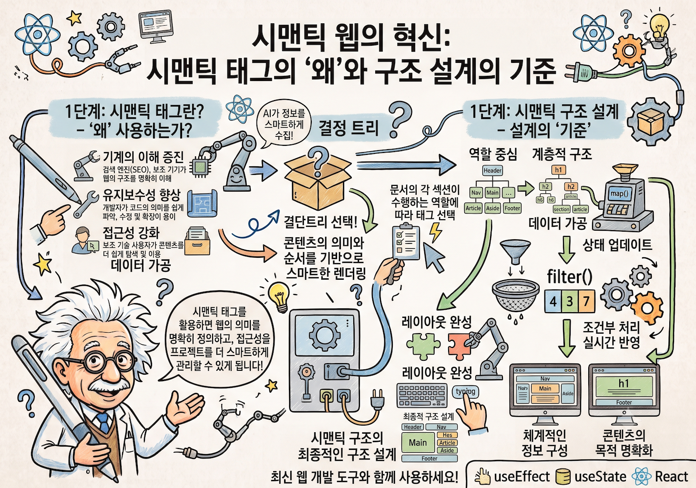
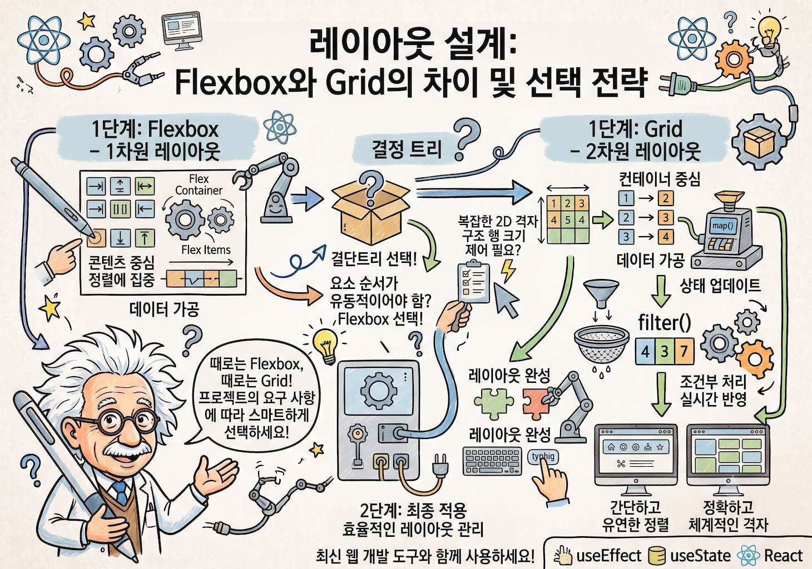
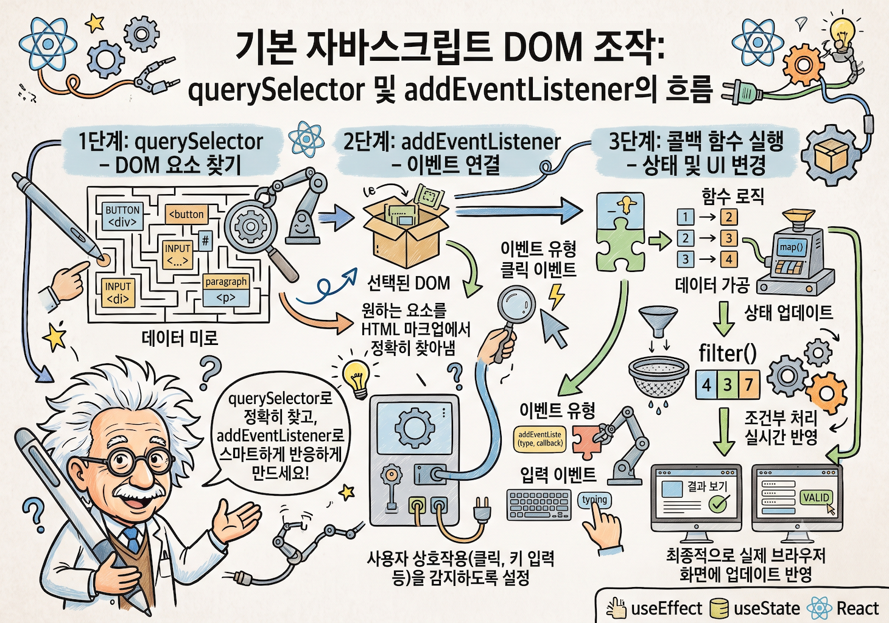
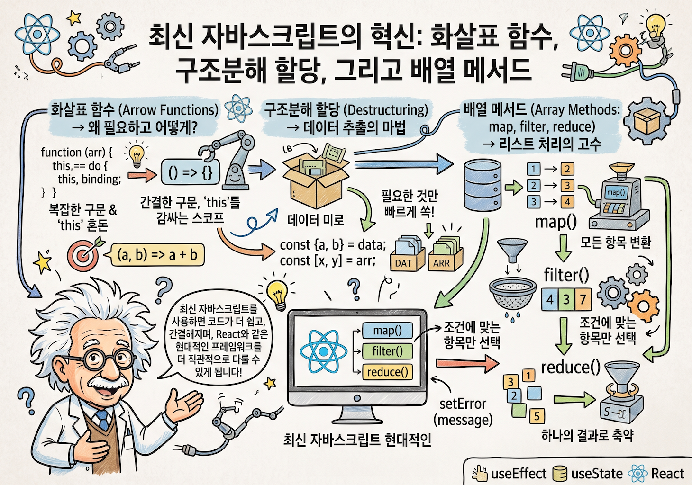
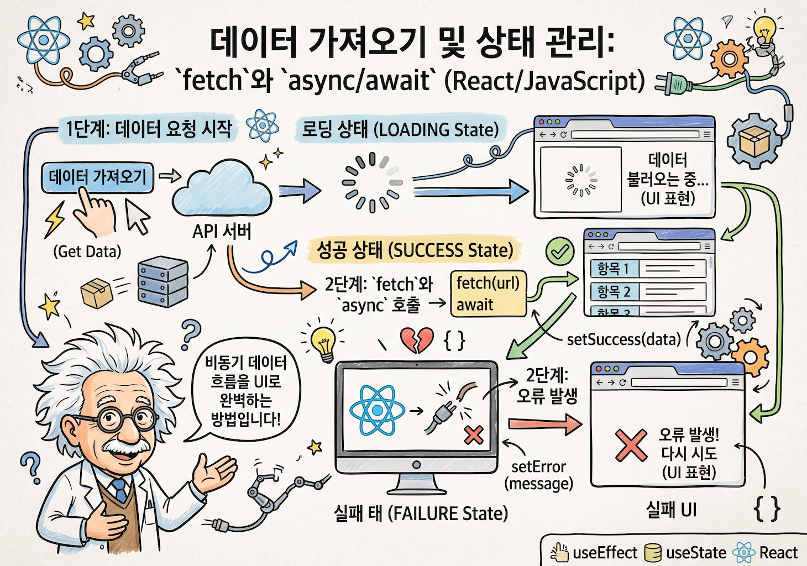
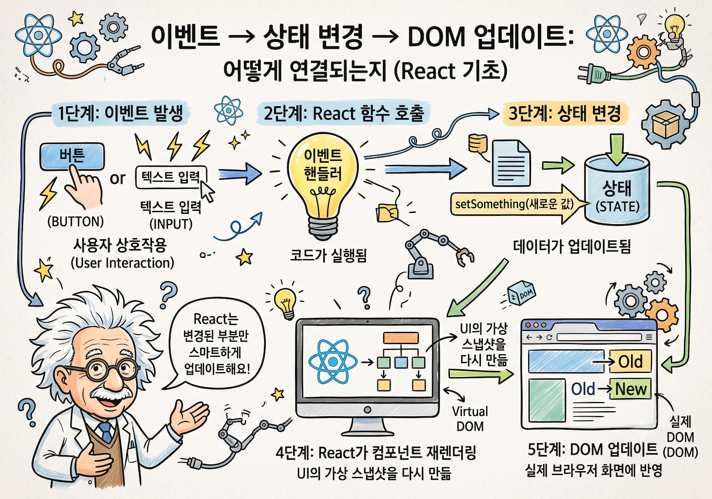

# 🌐 B4-1 나를 소개하는 반응형 포트폴리오 웹사이트

> 순수 **HTML5, CSS3, JavaScript(ES6+)**만으로 개발한 반응형 포트폴리오 웹사이트입니다.  
> 외부 라이브러리/프레임워크(React, Vue, Bootstrap, Tailwind 등) 없이 **"사용자 이벤트 → 상태(State) 변경 → DOM 렌더링"** 흐름을 직접 구축했습니다.

---

## 📌 1. 프로젝트 기본 정보

- **개발자**: 김동조 (nttkor)
- **학습 단계**: AI/SW 기초 (웹 기초와 프론트엔드)
- **저장소 URL**: [https://github.com/nttkor/b1_1](https://github.com/nttkor/b1_1)
- **배포 URL**: [https://nttkor.github.io/b1_1/](https://nttkor.github.io/b1_1/)
- **개발 환경**: VS Code + Live Server + Vanilla JS + Git/GitHub Pages

---

## 📸 2. 스크린샷

| 데스크톱 (라이트 모드) | 데스크톱 (다크 모드) |
| :---: | :---: |
|  |  |

| 모바일 (라이트 모드) | 모바일 (다크 모드) |
| :---: | :---: |
|  |  |

---

## 🛠 3. 사용 기술

| 분류 | 기술 | 적용 위치 |
| :--- | :--- | :--- |
| 구조 | HTML5 (시맨틱 태그) | `index.html` — header/nav/main/section/article/footer |
| 스타일 | CSS3 (변수, Flexbox, Grid, 미디어 쿼리) | `css/style.css` |
| 동작 | JavaScript ES6+ (async/await, 구조분해, 배열 메서드) | `js/app.js` |
| API | GitHub REST API | `fetch` → `api.github.com/users/nttkor/repos` |
| 저장소 | localStorage | 다크모드 설정 새로고침 유지 |
| 배포 | GitHub Pages | `nttkor.github.io/b1_1/` |
| 폰트·아이콘 | Google Fonts, Font Awesome | CDN (외부 라이브러리 미사용 원칙 준수) |

---

## 🎓 4. 과제 목표 — 6가지 핵심 개념 설명

> 미션 §3 "학습자는 아래를 스스로 설명할 수 있어야 한다" 에 대한 답변입니다.


### Q1. 시맨틱 태그를 왜 사용했나요?

`<div>`만 쓰면 브라우저·검색엔진·스크린 리더가 각 영역의 역할을 알 수 없습니다.  
`<header>`, `<nav>`, `<main>`, `<section>`, `<article>`, `<footer>` 를 사용해 **구역의 의미를 코드에 명시**했습니다.

- **SEO**: 검색엔진이 `<main>` 안의 콘텐츠를 핵심으로 인식
- **접근성**: 스크린 리더가 "navigation" "main content" 등을 자동 안내
- **선택 기준**: 독립 재사용 가능한 카드 → `<article>` / 관련 항목 묶음 → `<section>`




### Q2. Flexbox와 Grid를 어떻게 나눠 썼나요?

| | Flexbox | Grid |
| :--- | :--- | :--- |
| 방향 | 1차원 (가로 **또는** 세로) | 2차원 (가로 **AND** 세로) |
| 적용 위치 | `.nav-container` (로고↔메뉴 수평 배치) | `.projects-grid` (카드 격자 배치) |
| 이유 | 단순 수평 정렬은 Flexbox가 직관적 | `auto-fit + minmax`로 미디어 쿼리 없이 반응형 |

```css
/* Flexbox: 1차원 수평 정렬 */
.nav-container { display: flex; justify-content: space-between; }

/* Grid: 2차원 자동 반응형 격자 */
.projects-grid { display: grid; grid-template-columns: repeat(auto-fit, minmax(280px, 1fr)); }
```




### Q3. DOM 선택과 이벤트 연결을 어떻게 했나요?

**찾기 → 모으기 → 등록** 세 단계로 구성했습니다.

```javascript
// 1. 찾기: 페이지 로드 시 한 번만 선택해 elements 객체에 보관
const elements = { hamburgerBtn: document.getElementById('hamburger-btn'), ... };

// 2. 등록: HTML onclick 대신 addEventListener (관심사 분리)
elements.hamburgerBtn.addEventListener('click', () => { ... });

// 3. 동적 요소는 이벤트 위임: 부모에 리스너 하나로 자식 클릭 처리
elements.filterContainer.addEventListener('click', (e) => {
  if (e.target.classList.contains('filter-btn')) { ... }
});
```




### Q4. ES6+ 문법을 어떻게 활용했나요?

```javascript
// 화살표 함수: 콜백을 간결하게
const renderTheme = () => { ... };

// 구조분해 할당: 필요한 값만 추출
const { theme, isMenuOpen } = state;

// 템플릿 리터럴: HTML 동적 생성
const card = `<article class="project-card"><h3>${name}</h3></article>`;

// map: 배열 → HTML 카드 변환 / filter: 언어별 필터링
const cards = projects.filter(r => !r.fork).map(repo => `...`).join('');
```




### Q5. 비동기 통신과 4가지 UI 상태를 어떻게 처리했나요?

`idle → loading → success | error` 흐름으로 상태를 관리합니다.

```javascript
const fetchGitHubProjects = async () => {
  state.apiStatus = 'loading'; renderProjects(); // ① 로딩 스피너

  try {
    const res = await fetch(`https://api.github.com/users/nttkor/repos`);
    if (!res.ok) throw new Error(`코드: ${res.status}`); // ② 수동 에러 처리
    const data = await res.json();
    state.projects = data.filter(r => !r.fork);
    state.apiStatus = state.projects.length ? 'success' : 'empty'; // ③ 성공·빈 상태 구분

  } catch (e) {
    state.apiStatus = 'error'; state.errorMessage = e.message; // ④ 에러 상태
  } finally {
    renderProjects(); // 성공이든 실패든 항상 화면 갱신
  }
};
```




### Q6. 이벤트 → 상태 → 렌더링 흐름이 어떻게 연결되나요?

이벤트 핸들러에서 DOM을 직접 바꾸지 않고, **상태만 변경 → render 함수가 상태를 보고 화면 결정**합니다.

```javascript
// ❌ 나쁜 예: 이벤트에서 직접 DOM 조작 → 현재 상태 추적 불가
btn.addEventListener('click', () => { menu.style.left = '0'; });

// ✅ 우리 방식: 상태 변경 → render 함수가 상태 기반으로 화면 결정
btn.addEventListener('click', () => {
  state.isMenuOpen = !state.isMenuOpen; // 1. 상태만 변경
  renderMenu();                          // 2. render가 state를 보고 DOM 갱신
});
```

이 패턴은 **React의 `useState` + 리렌더링 흐름과 동일한 개념**입니다.  
React는 이 과정을 자동화한 것이고, 이 미션은 그 원리를 직접 구현합니다.




---

## 🎯 5. 최종 결과물 및 요구조건 달성 현황 (상세 주석 & GitHub 코드 링크)

미션 명세서(`mission.md`) 및 평가 질문지(`Eval.pdf`)의 **최종 결과물 5대 필수 조건**과 세부 기능 요구사항을 모두 충족하였으며, 각 조건별 실제 구현 코드 위치와 라인별 주석 설명을 아래와 같이 연결합니다.

---

### 📱 조건 1. 반응형 웹사이트 (Responsive Web)
> **요구사항**: 모바일, 태블릿, 데스크톱 등 모든 환경에서 레이아웃이 최적화되어야 하며, Hero, About, Skills, Projects, Contact, Footer 6개 섹션을 포함해야 한다.

* **[구현 1-1] 6개 시맨틱 섹션 구성**
  * **설명**: `div` 남용 없이 웹 접근성(Accessibility)과 SEO를 높이는 시맨틱 태그(`<header>`, `<nav>`, `<main>`, `<section>`, `<article>`, `<footer>`)로 설계.
  * **GitHub 코드 링크**: [`index.html (Line 24 ~ 190)`](https://github.com/nttkor/b1_1/blob/main/index.html#L24-L190) | 로컬 파일: [`index.html`](file:///Users/mpeg46551/b1_1/index.html)
  * **주요 코드 주석**:
    ```html
    <!-- Hero 섹션: 인사말, 타자기/소개글, CTA 버튼 -->
    <section id="hero" class="section hero-section">...</section>

    <!-- About 섹션: alt 속성을 준 프로필 이미지와 자기소개 -->
    <section id="about" class="section about-section">...</section>

    <!-- Skills 섹션: article 태그로 독립 카드화 -->
    <section id="skills" class="section skills-section">...</section>

    <!-- Projects 섹션: GitHub API 연동 카드 Grid 영역 -->
    <section id="projects" class="section projects-section">...</section>

    <!-- Contact 섹션: label-for 1:1 매칭 폼 영역 -->
    <section id="contact" class="section contact-section">...</section>
    ```

* **[구현 1-2] Flexbox & Grid 반응형 레이아웃 분리**
  * **설명**: 1차원 수평 정렬이 필요한 Navigation에는 **Flexbox**, 2차원 반응형 격자 배치가 필요한 Projects 카드에는 **Grid**(`repeat(auto-fit, minmax(280px, 1fr))`)를 선택하여 적용.
  * **GitHub 코드 링크**: [`css/style.css (Flexbox: L145 / Grid: L324)`](https://github.com/nttkor/b1_1/blob/main/css/style.css#L145) | 로컬 파일: [`css/style.css`](file:///Users/mpeg46551/b1_1/css/style.css)
  * **주요 코드 주석**:
    ```css
    /* Navigation Bar: Flexbox 적용 (로고 왼쪽, 메뉴 오른쪽 수평 정렬) */
    .nav-container {
      display: flex;
      justify-content: space-between;
      align-items: center;
    }

    /* Projects 카드 섹션: Grid 적용 (auto-fit과 minmax로 미디어쿼리 없는 자동 반응형) */
    .projects-grid {
      display: grid;
      grid-template-columns: repeat(auto-fit, minmax(280px, 1fr));
      gap: 1.5rem;
    }
    ```

* **[구현 1-3] 모바일 퍼스트 미디어 쿼리 (768px, 1024px)**
  * **설명**: 모바일 화면 스타일을 기본으로 작성하고, 768px(태블릿), 1024px(데스크톱) 미디어 쿼리로 점진적 확장.
  * **GitHub 코드 링크**: [`css/style.css (Line 466 ~ 508)`](https://github.com/nttkor/b1_1/blob/main/css/style.css#L466-L508)

---

### 🖱️ 조건 2. 인터랙티브 UI & 폼 유효성 검사 (Interactive UI)
> **요구사항**: 다크 모드 토글, 햄버거 메뉴, 부드러운 스크롤, 스크롤 애니메이션, 폼 유효성 검사가 정상 동작해야 한다.

* **[구현 2-1] 모바일 햄버거 메뉴 토글**
  * **설명**: 768px 미만 모바일에서 햄버거 버튼 클릭 시 `state.isMenuOpen`을 반전시키고 `classList.toggle('active')`로 메뉴 개폐.
  * **GitHub 코드 링크**: [`js/app.js (Line 49 & L215)`](https://github.com/nttkor/b1_1/blob/main/js/app.js#L49) | 로컬 파일: [`js/app.js`](file:///Users/mpeg46551/b1_1/js/app.js)
  * **주요 코드 주석**:
    ```javascript
    // 햄버거 메뉴 UI 렌더링 함수
    const renderMenu = () => {
      const { isMenuOpen } = state; // 구조분해 할당
      elements.hamburgerBtn.classList.toggle('active', isMenuOpen);
      elements.navMenu.classList.toggle('active', isMenuOpen);
    };
    ```

* **[구현 2-2] 스크롤 애니메이션 & 스크롤 탑 / 헤더 변경**
  * **설명**: `Intersection Observer` (threshold: 0.2)로 요소 진입 시 `.appear` 부여, 스크롤 60px 이상 시 헤더 스타일 변경(`.scrolled`), 300px 이상 시 스크롤탑 버튼 표시(`.visible`).
  * **GitHub 코드 링크**: [`js/app.js (Line 230 ~ 285)`](https://github.com/nttkor/b1_1/blob/main/js/app.js#L230-L285)

* **[구현 2-3] Contact 폼 유효성 검사 (Form Validation & UX)**
  * **설명**: `e.preventDefault()`로 폼 기본 제출 동작을 막고, 이름/이메일(정규식)/메시지 필수값을 검증하여 에러 피드백 노출.
  * **GitHub 코드 링크**: [`js/app.js (Line 150 ~ 200)`](https://github.com/nttkor/b1_1/blob/main/js/app.js#L150-L200)
  * **주요 코드 주석**:
    ```javascript
    // 이메일 정규표현식 검증
    const emailRegex = /^[^\s@]+@[^\s@]+\.[^\s@]+$/;
    if (!emailRegex.test(emailVal)) {
      elements.emailError.textContent = '올바른 이메일 형식이 아닙니다.';
      elements.userEmailInput.classList.add('invalid');
      isValid = false;
    }
    ```

---

### 🌐 조건 3. 외부 GitHub API 연동 & 4가지 UI 상태 (Async API & State UI)
> **요구사항**: GitHub API에서 본인의 저장소 목록을 가져와 Projects 섹션에 동적으로 렌더링하며, 로딩/성공/에러/빈 상태가 UI로 표현되어야 한다.

* **[구현 3-1] `fetch` 및 `async/await` 비동기 통신 + `try/catch` 에러 처리**
  * **설명**: 엔드포인트 `https://api.github.com/users/nttkor/repos`를 비동기 호출하고, 403 Rate Limit 및 네트워크 오류를 예외 처리.
  * **에러 처리 정책**: `403` → "Rate Limit 초과" / 그 외 `!response.ok` → "코드: N" / 네트워크 단절 → "네트워크 오류". 모든 에러 상태에서 [다시 시도] 버튼을 제공해 사용자 주도의 수동 재호출을 지원.
  * **재시도 전략**: 자동 백오프(exponential backoff)는 미구현. 에러 발생 시 UI에 [다시 시도] 버튼을 제공하여 사용자 주도의 단일 재시도를 지원함.
  * **GitHub 코드 링크**: [`js/app.js (Line 115 ~ 145)`](https://github.com/nttkor/b1_1/blob/main/js/app.js#L115-L145)

* **[구현 3-2] 4가지 UI 상태 표현 (Loading, Success, Error, Empty)**
  * **설명**: 단일 상태 `state.apiStatus`에 따라 조건부 렌더링 수행.
  * **GitHub 코드 링크**: [`js/app.js (Line 57 ~ 110)`](https://github.com/nttkor/b1_1/blob/main/js/app.js#L57-L110)
  * **상태별 렌더링 정리**:
    1. **로딩(loading)**: `<div class="spinner"></div>` 스피너 애니메이션 표시.
    2. **성공(success)**: `array.map()`과 템플릿 리터럴로 카드 동적 변환 후 `innerHTML` 반영.
    3. **에러(error)**: 에러 메시지 + `[다시 시도]` 버튼 제공 (재시도 클릭 시 API 재호출).
    4. **빈 상태(empty)**: "표시할 프로젝트가 없습니다." 안내 문구 렌더링.

* **[구현 3-3] 보너스 과제: 언어별 프로젝트 필터링 (`array.filter()`)**
  * **설명**: 필터 버튼 클릭 시 `state.filterLanguage`를 변경하고 `projects.filter()`로 걸러진 프로젝트만 카드 출력.
  * **GitHub 코드 링크**: [`js/app.js (Line 80 & L250)`](https://github.com/nttkor/b1_1/blob/main/js/app.js#L80)

---

### 💾 조건 4. 상태 유지 및 다크 모드 (State Persistence)
> **요구사항**: 다크 모드 설정이 로컬스토리지(localStorage)에 저장되어 새로고침 후에도 유지되어야 한다.

* **[구현 4-1] LocalStorage 연동 및 테마 스위칭**
  * **설명**: 초기 상태 로딩 시 `localStorage.getItem('theme') || 'light'`로 읽어오며, 토글 버튼 클릭 시 `setAttribute('data-theme', theme)` 및 `localStorage.setItem('theme', theme)` 수행.
  * **시스템 다크모드 감지**: `prefers-color-scheme` 미디어 쿼리를 통한 OS 다크모드 자동 감지는 **미구현** (선택 사항). 사용자가 직접 토글 버튼으로 테마를 선택하는 방식만 지원하며, 선택값은 localStorage에 영속 저장된다.
  * **GitHub 코드 링크**: [`js/app.js (Line 13 & L38)`](https://github.com/nttkor/b1_1/blob/main/js/app.js#L13) | [`css/style.css (Line 38 ~ 59)`](https://github.com/nttkor/b1_1/blob/main/css/style.css#L38-L59)
  * **주요 코드 주석**:
    ```javascript
    // 테마 변경 렌더러
    const renderTheme = () => {
      const { theme } = state;
      elements.html.setAttribute('data-theme', theme);
      localStorage.setItem('theme', theme); // 새로고침 후에도 상태 유지
    };
    ```

---

### 🚀 조건 5. 배포 및 README 명세 (Deployment)
> **요구사항**: GitHub Pages로 배포되어 외부 접속이 가능해야 하며, README에 설명, 기술, 배포 URL이 포함되어야 한다.

* **[구현 5-1] GitHub Pages 자동 배포 완료**
  * **배포 URL**: **[https://nttkor.github.io/b1_1/](https://nttkor.github.io/b1_1/)**
  * **상태**: `main` 브랜치 `/ (root)` 디렉터리 기준 정상 빌드 및 HTTPS 인포스 활성화 완료.

---

## 📁 6. 프로젝트 폴더 구조

```text
b1_1/
├── index.html          # 시맨틱 HTML5 구조 문서
├── css/
│   └── style.css       # 메인 스타일시트 (CSS 변수, Flexbox/Grid, 모바일 퍼스트 반응형)
├── js/
│   └── app.js          # JavaScript (중앙 State 관리, API 통신, DOM 조작, 이벤트)
├── infographic/        # 과제 목표 6가지 핵심 개념 인포그래픽 (ChatGPT/Gemini 각 2종)
│   ├── 0_web_guide.png
│   ├── 1_시맨틱태그_ChatGPT.png / Gemini.png
│   ├── 2_FlexboxGrid_ChatGPT.png / Gemini.png
│   ├── 3_querySelector_ChatGPT.png / Gemini.png
│   ├── 4_화살표함수_ChatGPT.png / Gemini.png
│   ├── 5_fetch_async_await_ChatGPT.png / Gemini.png
│   └── 6_DOMTree_ChatGPT.png / Gemini.png
├── pic/                # 스크린샷 (데스크톱/모바일 × 라이트/다크)
├── doc/
│   ├── plan.md         # 미션 구현 계획서 & 평가 인터뷰 모범 Q&A 10선
│   ├── code_review.md  # 라인별 상세 코드 리뷰 및 아키텍처 분석 문서
│   ├── mission.md      # 미션 요구사항 원본
│   └── Eval.pdf        # 평가 질문지 및 레퍼런스
└── README.md           # [본 문서] 최종 결과물 요구조건 달성 보고서
```

> **이미지 참고**: About 섹션의 프로필 이미지는 로컬 파일이 아닌 외부 URL(Unsplash CDN)을 사용합니다. 별도 `images/` 폴더는 존재하지 않으며, 실제 프로필 사진으로 교체 시 `index.html`의 `` 경로를 수정하면 됩니다.

---

## 📚 7. 평가 인터뷰 대비 및 추가 가이드 문서

- 📄 **[doc/plan.md](doc/plan.md)**: 평가 15개 문항에 대한 핵심 인터뷰 답변집
- 📖 **[doc/code_review.md](doc/code_review.md)**: 전체 코드 구조 및 라인별 종합 분석 보고서

---

## 🔤 8. 용어 & 기술 상세 설명 (초보자용)

> 발표 및 평가 준비를 위한 용어 설명 모음입니다. 각 링크를 클릭하면 상세 내용을 볼 수 있습니다.

### 🌐 웹 기초

| 용어 | 한 줄 요약 | 상세 설명 |
| :--- | :--- | :--- |
| **HTML / CSS / JavaScript** | 웹의 뼈대·인테리어·전기 시스템 | [📖 설명 보기](doc/study.md#html-css-javascript) |
| **시맨틱 태그** | 의미 있는 HTML 태그(`<header>`, `<nav>` 등) | [📖 설명 보기](doc/study.md) |
| **반응형 웹 & 모바일 퍼스트** | 화면 크기에 따라 자동 적응, 모바일 기준 우선 설계 | [📖 설명 보기](doc/study.md#responsive) |
| **미디어 쿼리** | 화면 너비 조건별 CSS 적용 (`@media`) | [📖 설명 보기](doc/study.md#responsive) |

### 🎨 CSS 레이아웃

| 용어 | 한 줄 요약 | 상세 설명 |
| :--- | :--- | :--- |
| **Flexbox** | 1차원(한 방향) 요소 정렬 — 네비게이션, 버튼 그룹 | [📖 설명 보기](doc/study.md#layout) |
| **Grid** | 2차원(행×열) 요소 배치 — 카드 목록, 갤러리 | [📖 설명 보기](doc/study.md#layout) |
| **CSS 변수 (Custom Properties)** | `:root`에 색상 등 값을 변수로 선언하고 재사용 | [📖 설명 보기](doc/study.md#css-variables) |

### ⚡ JavaScript 핵심 패턴

| 용어 | 한 줄 요약 | 상세 설명 |
| :--- | :--- | :--- |
| **이벤트 → 상태 → 렌더링** | 모던 프론트엔드의 핵심 흐름 | [📖 설명 보기](doc/study.md#event-state-render) |
| **Single Source of Truth** | 앱 상태를 `state` 객체 하나에 집중 관리 | [📖 설명 보기](doc/study.md#single-source) |
| **다크 모드 전환** | CSS 변수 + localStorage + 이벤트-상태-렌더 흐름 종합 | [📖 설명 보기](doc/study.md#다크-모드-전환-기능) |
| **햄버거 메뉴** | classList.toggle + aria-expanded + 미디어 쿼리 | [📖 설명 보기](doc/study.md#햄버거메뉴) |

### 🌍 비동기 & API

| 용어 | 한 줄 요약 | 상세 설명 |
| :--- | :--- | :--- |
| **fetch / async-await / try-catch** | 서버에 데이터 요청하고 오류 처리하는 비동기 코드 | [📖 설명 보기](doc/study.md#async) |
| **GitHub REST API** | URL 기반으로 GitHub 저장소 데이터를 가져오는 인터페이스 | [📖 설명 보기](doc/study.md#github-api) |
| **localStorage** | 새로고침 후에도 유지되는 브라우저 내장 저장소 | [📖 설명 보기](doc/study.md#localstorage) |
| **Intersection Observer** | 요소가 화면에 진입했을 때를 감지하는 브라우저 API | [📖 설명 보기](doc/study.md#intersection-observer) |

### ♿ 웹 접근성 (ARIA)

| 용어 | 한 줄 요약 | 상세 설명 |
| :--- | :--- | :--- |
| **폼 유효성 검사** | 입력값 형식을 서버 전송 전 브라우저에서 검증 | [📖 설명 보기](doc/study.md#form-validation) |
| **aria-label** | 아이콘 버튼에 스크린 리더용 설명 텍스트 추가 | [📖 설명 보기](doc/study.md#aria) |
| **aria-expanded** | 메뉴 열림/닫힘 상태를 스크린 리더에게 알림 | [📖 설명 보기](doc/study.md#aria) |
| **role="alert" / aria-live** | 동적으로 나타나는 에러 메시지를 스크린 리더가 즉시 읽게 함 | [📖 설명 보기](doc/study.md#aria) |
| **스킵 링크 (Skip Link)** | 키보드 사용자가 본문으로 바로 이동하는 링크 | [📖 설명 보기](doc/study.md#aria) |
| **:focus-visible** | 키보드 탐색 시에만 포커스 윤곽선 표시 | [📖 설명 보기](doc/study.md#aria) |
