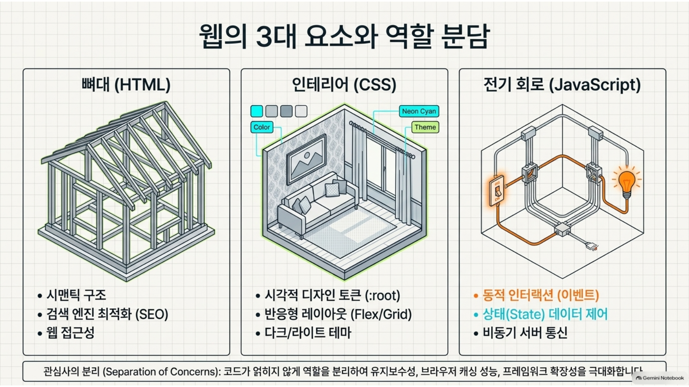
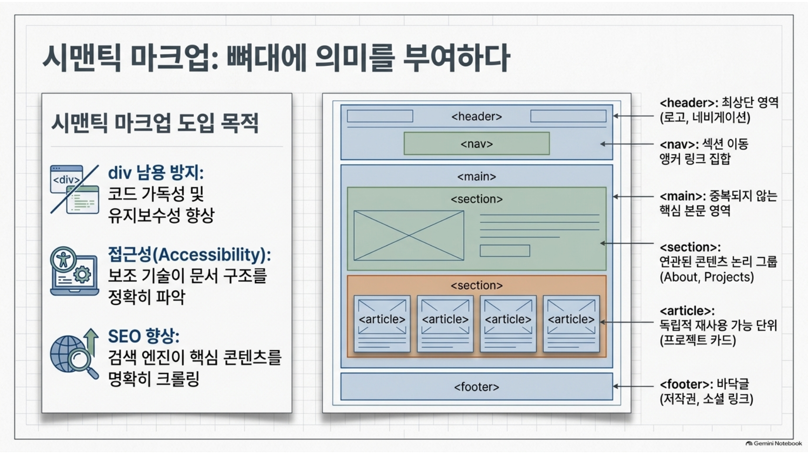
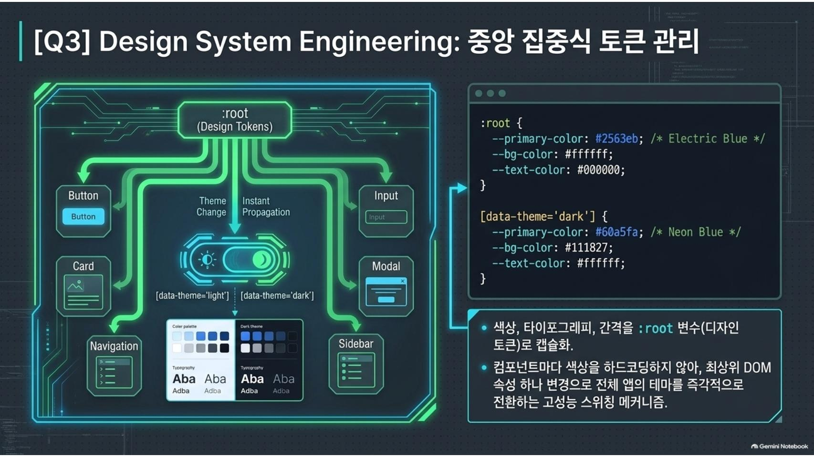
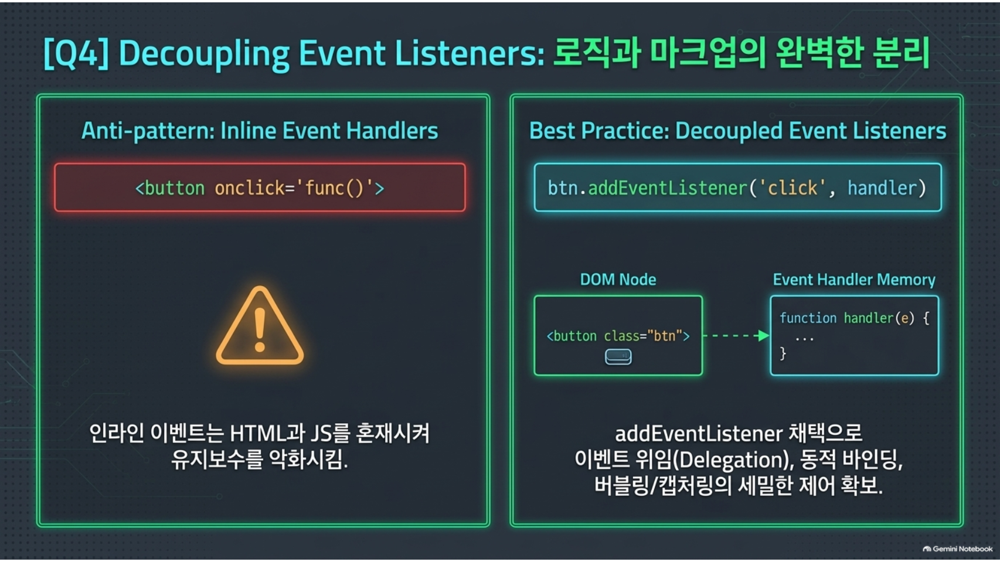
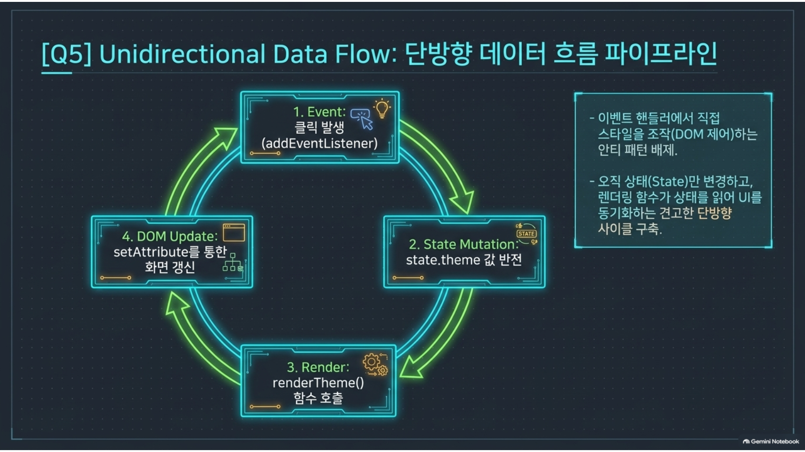
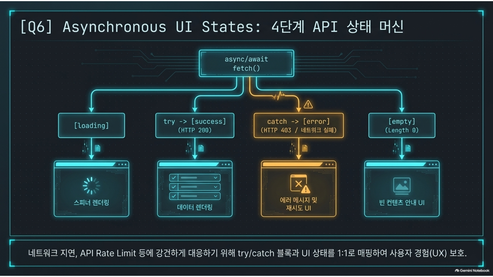
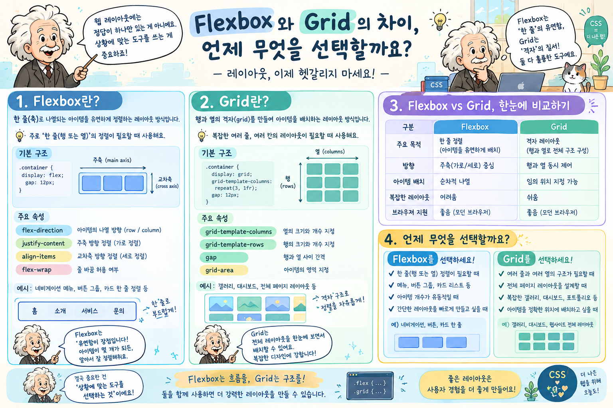
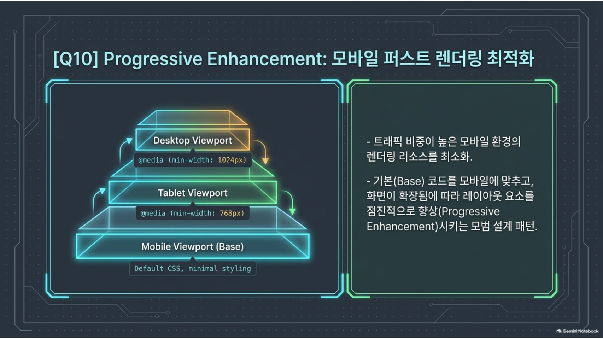

## 🎯 평가 인터뷰 질문지 (Eval.pdf) 완전 대비 Q&A 가이드

후일 평가를 받을 때 아래 질문들에 대해 자신감 있게 답변할 수 있도록 정리한 핵심 내용입니다.

> 각 답변에 연결된 🔗 링크를 클릭하면 **study.md의 해당 이론 설명**과 **실제 소스코드**를 바로 확인할 수 있습니다.

---

### ❓ Q1. HTML, CSS, JavaScript를 분리한 이유와 각 파일의 역할은 무엇인가요?

- **답변**: 
  - **관심사의 분리(Separation of Concerns)** 원칙을 따르기 위함입니다. 
  - **HTML (`index.html`)**: 웹페이지의 구조와 의미(Semantic Structure)를 담당합니다.
  - **CSS (`css/style.css`)**: 시각적 스타일, 레이아웃, 반응형 디자인 및 테마 표현을 담당합니다.
  - **JavaScript (`js/app.js`)**: 동적 인터랙션, 사용자 이벤트 처리, 비동기 API 통신 및 상태(State)에 따른 DOM 조작을 담당합니다.
  - 파일 분리를 통해 코드의 재사용성과 유지보수성이 향상되며, 브라우저가 CSS와 JS를 캐싱하여 로딩 성능도 개선됩니다.
- 📖 이론: [study.md — HTML·CSS·JS 역할 분리](study.md#html-css-javascript)
- 💻 소스: [`app.js` 주석 1번 (전역 상수 & 상태 객체)](../js/app.js#L1-L13) | [`style.css` CSS 변수 섹션](../css/style.css#L1-L43) | [`index.html`](../index.html)

---

### ❓ Q2. 시맨틱 태그(`<header>`, `<nav>`, `<main>`, `<section>`, `<footer>` 등)를 사용한 이유는 무엇이며 어떤 기준으로 선택했나요?

- **답변**:
  - `div` 남용을 막고, **웹 접근성(Accessibility)** 및 **검색 엔진 최적화(SEO)**를 높이기 위해 시맨틱 태그를 사용했습니다.
  - **선택 기준**:
    - `<header>`: 로고와 메인 네비게이션이 위치하는 최상단 영역
    - `<nav>`: 섹션 이동 앵커 링크들의 집합 영역
    - `<main>`: 문서의 핵심 주제이자 중복되지 않는 본문 콘텐츠 영역
    - `<section>`: Hero, About, Skills, Projects, Contact 등 연관된 콘텐츠를 논리 그룹으로 묶는 영역
    - `<article>`: Projects 섹션 내부의 카드처럼 독립적으로 존재 가능한 콘텐츠 단위
    - `<footer>`: 저작권, 소셜 링크 등 바닥글 정보 영역
- 📖 이론: [study.md — 시맨틱 태그 선택 기준](study.md#semantic)
- 💻 소스: [`index.html` — 전체 시맨틱 구조](../index.html) | [`app.js` — project-card article 생성](../js/app.js#L209-L232)

---

### ❓ Q3. CSS 변수(`:root`)를 사용한 이유와 어떤 이점이 있나요?
- **답변**:

  - **중앙 집중식 디자인 시스템 구축**을 위해서입니다.
  - primary 색상, 배경색, 폰트 크기 등을 `:root`에 변수로 선언해 두면, 코드 전체에서 일관된 스타일을 유지할 수 있습니다.
  - 특히 다크 모드 구현 시 `[data-theme="dark"]` 속성 아래에서 변수 값만 바꿔주면 전체 페이지의 테마가 한 번에 전환되므로 테마 관리 및 유지보수가 매우 손쉽습니다.
- 📖 이론: [study.md — CSS 변수 (Custom Properties)](study.md#css-variables)
- 💻 소스: [`style.css` — :root 변수 선언 (L1-L43)](../css/style.css#L1-L43) | [`style.css` — 다크 테마 변수 재정의 (L50-L70)](../css/style.css#L50-L70)

---

### ❓ Q4. HTML의 `onclick` 인라인 속성 대신 JavaScript의 `addEventListener`를 사용한 이유는 무엇인가요?

- **답변**:

  - **HTML(구조)과 JS(로직)의 분리**를 유지하기 위해서입니다.
  - HTML 태그 내에 `onclick="func()"`을 적으면 구조와 로직이 섞여 코드가 지저분해지고 유지보수가 어렵습니다.
  - `addEventListener`를 사용하면 한 요소에 복수의 이벤트 리스너를 등록할 수 있고, 이벤트 캡처링/버블링 단계를 제어할 수 있으며, 동적으로 이벤트를 바인딩하거나 해제(`removeEventListener`)하기 용이합니다.
- 📖 이론: [study.md — 이벤트 → 상태 → 렌더링 패턴](study.md#event-state-render)
- 💻 소스: [`app.js` — setupEventListeners() 함수 (L375-L473)](../js/app.js#L375-L473)

---

### ❓ Q5. "이벤트 → 상태 변경 → 화면 업데이트" 흐름이 코드에서 어떻게 동작하는지 설명해보세요.
- **답변 (예: 다크 모드 토글)**:

  1. **이벤트(Event)**: 사용자가 테마 토글 버튼을 클릭합니다 (`button.addEventListener('click', ...)`)
  2. **상태 변경(State Change)**: `state.theme = state.theme === 'light' ? 'dark' : 'light'` 코드가 실행되어 `state` 객체의 값이 갱신됩니다.
  3. **화면 업데이트(Render)**: 갱신된 `state.theme` 값을 바탕으로 `document.documentElement.setAttribute('data-theme', state.theme)`를 수행하여 화면 스타일이 즉시 바뀝니다.
- 📖 이론: [study.md — 이벤트 → 상태 → 렌더링 패턴](study.md#event-state-render) | [study.md — 다크 모드 전환 기능](study.md#다크-모드-전환)
- 💻 소스: [`app.js` — 테마 토글 이벤트 (L378-L382)](../js/app.js#L378-L382) | [`app.js` — renderTheme() (L81-L99)](../js/app.js#L81-L99)

---

### ❓ Q6. `async/await`와 `try/catch`로 API 호출 성공과 실패를 어떻게 분기 처리했나요?
- **답변**:

  - `async` 함수 내에서 `fetch(url)`를 `await`로 호출하여 비동기 응답을 기다립니다.
  - **성공 처리 (`try`)**: 응답 status가 `res.ok` (200대)인 경우 JSON 변환 후 `state.projects`에 저장하고, `state.apiStatus = 'success'`로 지정한 뒤 프로젝트 카드를 화면에 렌더링합니다. (저장소가 비어있다면 `state.apiStatus = 'empty'`)
  - **실패 처리 (`catch`)**: 네트워크 오류나 API Rate Limit (403 forbidden) 발생 시 `catch` 블록으로 이동하여 `state.apiStatus = 'error'`로 설정하고, 사용자에게 "프로젝트를 불러올 수 없습니다" 메시지와 [재시도] 버튼을 렌더링합니다.
  - **항상 실행 (`finally`)**: 성공/실패 여부와 관계없이 `renderProjects()`를 호출해 화면을 최신 상태로 업데이트합니다.
- 📖 이론: [study.md — 비동기 통신 fetch/async-await/try-catch](study.md#async) | [study.md — GitHub REST API 연동](study.md#github-api)
- 💻 소스: [`app.js` — fetchGitHubProjects() (L250-L293)](../js/app.js#L250-L293)

---

### ❓ Q7. `map`, `filter` 등 배열 메서드로 GitHub 데이터를 카드 UI로 변환하는 과정을 설명해보세요.
- **답변**:

  - **`filter` (데이터 정제)**: API로 전달받은 전체 저장소 배열에서 포크된 저장소를 제외하거나(`!repo.fork`), 사용자가 선택한 특정 언어(`state.filterLanguage`)에 해당하는 저장소만 걸러냅니다.
  - **`map` (데이터 → UI 변환)**: 걸러진 저장소 객체 배열을 순회하며, 템플릿 리터럴(Template Literal)을 이용해 `<article class="project-card">` 형태의 HTML 태그 문자열 배열로 변환합니다.
  - 마지막으로 `.join('')`을 호출해 하나의 거대한 HTML 문자열로 합친 뒤 `projectsContainer.innerHTML`에 할당하여 화면에 렌더링합니다.
- 💻 소스: [`app.js` — filter로 fork 제외 (L278)](../js/app.js#L276-L281) | [`app.js` — filter 언어 필터링 (L164-L177)](../js/app.js#L162-L177) | [`app.js` — map으로 카드 HTML 생성 (L194-L233)](../js/app.js#L194-L233)

---

### ❓ Q8. Flexbox와 Grid를 각각 어디에 적용했고, 왜 그렇게 선택했나요?

- **답변**:
  - **Flexbox (1차원 레이아웃)**: Navigation Bar (`<nav>`)와 Header 영역에 사용했습니다. 로고와 메뉴 항목들을 수평 1직선상으로 정렬하고 양 끝 배치(`justify-content: space-between`), 수직 중앙 정렬(`align-items: center`)을 수행하기에 Flexbox가 가장 적합합니다.
  - **Grid (2차원 레이아웃)**: Projects 카드 섹션에 사용했습니다. 여러 개의 카드 항목을 가로/세로 격자 형태로 배열할 때 `grid-template-columns: repeat(auto-fit, minmax(280px, 1fr))`를 작성하면, 별도의 미디어 쿼리 없이도 화면 크기에 맞춰 반응형 카드가 자동으로 배치되므로 Grid가 유리합니다.
- 📖 이론: [study.md — Flexbox vs Grid](study.md#layout)
- 💻 소스: [`style.css` — nav-container Flexbox 적용 부분](../css/style.css) | [`style.css` — projects-grid Grid 적용 부분](../css/style.css)

---

### ❓ Q9. `state` 객체를 따로 만들어 관리한 이유는 무엇이며, 그냥 개별 변수로 처리하면 안 되나요?
- **답변**:

  - 애플리케이션의 현재 화면 상태를 **단일 출처(Single Source of Truth)** 로 통일성 있게 추적하고 관리하기 위해서입니다.
  - 개별 `let theme = 'light'; let loading = true;` 변수로 흩어져 있으면 어떤 이벤트에서 어떤 변수가 바뀌었는지 추적하기 힘듭니다.
  - `state`라는 하나의 중앙 객체로 모아두면, `console.log(state)` 한 번으로 앱 전체 상태를 즉시 확인할 수 있고, React의 State 개념을 바닐라 JS 수준에서 모방하여 구조화된 개발이 가능해집니다.
- 📖 이론: [study.md — Single Source of Truth (중앙 상태 관리)](study.md#single-source)
- 💻 소스: [`app.js` — state 객체 정의 (L27-L37)](../js/app.js#L27-L37)

---

### ❓ Q10. 반응형 디자인에서 "모바일 퍼스트(Mobile First)"로 작성한 이유는 무엇인가요?
- **답변**:

  - **성능 및 코드 간결성**: 리소스가 제한적인 모바일 환경의 스타일을 기본(Base)으로 먼저 작성하고, 화면이 넓어짐에 따라 `@media (min-width: ...)`로 레이아웃 요소를 확장/추가하는 방식이 코드 불필요성을 줄여줍니다.
  - **사용자 경험(UX)**: 오늘날 대부분의 웹 접속이 모바일에서 이루어지므로 모바일 최적화를 최우선으로 고려하고 복잡한 데스크톱 레이아웃으로 점진적 향상(Progressive Enhancement)을 이루는 것이 모범 디자인 패턴입니다.
- 📖 이론: [study.md — 반응형 웹 & 모바일 퍼스트 & 미디어 쿼리](study.md#responsive)
- 💻 소스: [`style.css` — 모바일 퍼스트 미디어 쿼리 패턴](../css/style.css) | [`app.js` — 햄버거 메뉴 모바일 처리](../js/app.js#L384-L401)

---

### ❓ Q11. `localStorage`를 사용해 테마를 저장하는 이유는 무엇인가요?
- **답변**:
  - 브라우저를 닫거나 페이지를 새로고침해도 사용자가 선택한 테마(다크/라이트)가 유지되도록 하기 위해서입니다.
  - `localStorage`는 **서버와 통신 없이** 사용자 브라우저 내부에 키-값 쌍으로 데이터를 저장하며, 탭을 닫아도 삭제되지 않습니다.
  - 앱 시작 시 `localStorage.getItem('theme') || 'light'`로 저장된 테마를 읽어와 초기값으로 사용하고, 테마 변경 시 `localStorage.setItem('theme', theme)`으로 저장합니다.
- 📖 이론: [study.md — localStorage (브라우저 저장소)](study.md#localstorage)
- 💻 소스: [`app.js` — state 초기화 시 localStorage 읽기 (L30)](../js/app.js#L27-L37) | [`app.js` — renderTheme() localStorage 저장 (L90)](../js/app.js#L81-L99)

---

### ❓ Q12. 웹 접근성(ARIA)을 위해 어떤 처리를 했나요?
- **답변**:
  - **`aria-label`**: 아이콘만 있는 버튼(`#theme-toggle`, `#hamburger-btn`)에 스크린 리더가 읽을 텍스트를 제공합니다. 예) `aria-label="테마 전환"`, `aria-label="메뉴 열기"`
  - **`aria-expanded`**: 햄버거 메뉴의 열림/닫힘 상태(`true`/`false`)를 JS에서 동적으로 업데이트해 스크린 리더가 현재 상태를 알 수 있도록 합니다.
  - **`role="alert"` + `aria-live="assertive"`**: 폼 에러 메시지가 동적으로 생길 때 스크린 리더가 즉시 읽도록 처리합니다.
  - **스킵 링크(Skip Link)**: 키보드 사용자가 헤더 메뉴를 건너뛰고 본문으로 바로 이동할 수 있는 링크를 제공합니다.
  - **`:focus-visible`**: 키보드 Tab 탐색 시에만 포커스 윤곽선이 보이도록 처리합니다.
- 📖 이론: [study.md — 웹 접근성 (ARIA)](study.md#aria)
- 💻 소스: [`app.js` — aria-expanded 업데이트 (L116)](../js/app.js#L106-L119) | [`style.css` — skip-link 스타일 (L77-L92)](../css/style.css#L77-L92)

---

### ❓ Q13. 스크롤 애니메이션(Intersection Observer)을 사용한 이유와 작동 방식은?
- **답변**:
  - 스크롤 이벤트로 요소의 위치를 직접 계산하는 방식(`window.scrollY`)은 스크롤마다 함수가 수백 번 실행되어 **성능에 부담**이 됩니다.
  - `IntersectionObserver`는 브라우저가 자체적으로 요소의 화면 진입 여부를 감지하기 때문에 **훨씬 성능이 좋습니다**.
  - 동작 방식: `.fade-in` 클래스를 가진 요소들을 관찰 대상으로 등록하고, 요소가 화면에 20% 이상 보이는 순간 `.appear` 클래스를 추가하여 CSS의 `opacity`, `transform` 전환 애니메이션을 트리거합니다. 한 번 등장한 요소는 `unobserve`로 관찰을 중단합니다.
- 📖 이론: [study.md — Intersection Observer (스크롤 애니메이션)](study.md#intersection-observer)
- 💻 소스: [`app.js` — setupScrollAnimation() (L481-L504)](../js/app.js#L481-L504)

---

### ❓ Q14. 폼 유효성 검사(Form Validation)는 어떻게 구현했나요?
- **답변**:
  - `validateForm()` 함수에서 이름, 이메일, 메시지 세 필드를 순서대로 검증합니다.
  - **이름**: `.trim()`으로 공백 제거 후 빈값 여부 체크
  - **이메일**: 빈값 체크 + 정규표현식(`/^[^\s@]+@[^\s@]+\.[^\s@]+$/`)으로 형식 검증
  - **메시지**: 빈값 체크 + 최소 5자 이상 확인
  - 오류 시 해당 입력창에 `invalid` 클래스를 추가해 빨간 테두리를 보여주고, `role="alert"` 영역에 에러 메시지를 표시합니다.
  - `input` 이벤트로 **실시간 검증**도 구현해 사용자가 타이핑하는 즉시 피드백을 제공합니다.
  - 폼 제출 시 `e.preventDefault()`로 기본 페이지 새로고침을 막고, 검증 통과 시에만 성공 메시지를 표시합니다.
- 📖 이론: [study.md — 폼 유효성 검사](study.md#form-validation)
- 💻 소스: [`app.js` — validateForm() (L304-L367)](../js/app.js#L304-L367) | [`app.js` — 폼 제출 이벤트 (L449-L464)](../js/app.js#L449-L464) | [`app.js` — 실시간 검증 (L470-L472)](../js/app.js#L470-L472)

---

## 🛠️ 향후 실행 순서 안내

1. **`index.html` 작성**: 시맨틱 태그 뼈대 구축
2. **`css/style.css` 작성**: 디자인 시스템 & 모바일 퍼스트 레이아웃 적용
3. **`js/app.js` 작성**: State 객체 정의, 이벤트 연결, API 연동, DOM 렌더링 구현
4. **로컬 테스트 & 디버깅**: Live Server를 사용하여 다크모드, API 에러/로딩, 폼 검증 작동 테스트
5. **`README.md` 작성 및 GitHub Pages 배포**

---

## 📚 참고 자료

| 문서 | 내용 |
| :--- | :--- |
| [study.md](study.md) | 전체 이론 학습 내용 (HTML·CSS·JS 원리, 패턴 상세 설명) |
| [plan.md](plan.md) | 프로젝트 구현 계획 및 단계별 진행 내용 |
| [js/app.js](../js/app.js) | 실제 JavaScript 소스코드 (전체 주석 포함) |
| [css/style.css](../css/style.css) | 실제 CSS 소스코드 (전체 주석 포함) |
| [index.html](../index.html) | HTML 구조 파일 |
