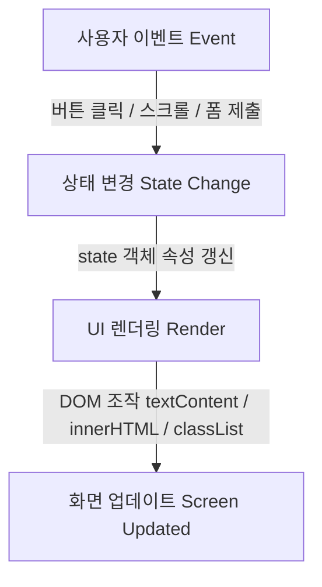

# 📖 B4-1 포트폴리오 프로젝트 상세 코드 리뷰 (Code Review)

> **GitHub 저장소**: [https://github.com/ntt65/b4_1](https://github.com/ntt65/b4_1)  
> **배포 라이브 사이트**: [https://ntt65.github.io/b4_1/](https://ntt65.github.io/b4_1/)  
> **작성자**: 김동조  
> **목적**: 프로젝트 전반의 아키텍처 개요, 코드 라인별 역할 상세 주석 해설, 평가 인터뷰용 코드 흐름 가이드 정리.

---

## 💡 1. 프로젝트 개요 & 아키텍처 원칙

본 프로젝트는 외부 라이브러리(React, Vue, jQuery, TailwindCSS 등)를 일체 사용하지 않고, 순수 **HTML5, CSS3, Vanilla JavaScript(ES6+)**만으로 작성되었습니다.

### 🌟 핵심 설계 패턴: 단일 출처 상태 관리 (Single Source of Truth)
React의 `useState` 또는 Redux 패턴의 기초 원리를 바닐라 자바스크립트로 구현했습니다.



1. **상태(State) 객체 정의**: 애플리케이션의 모든 동적 데이터(테마, 메뉴 개폐, 저장소 리스트, API 상태 등)를 하나의 `state` 객체에 모아 관리합니다.
2. **이벤트 리스너(Event Listener)**: HTML에 인라인 `onclick`을 사용하지 않고 `addEventListener`를 통해서만 이벤트를 감지합니다.
3. **독립 렌더러(Render Function)**: 상태가 변경되면 해당 상태를 담당하는 렌더링 함수(`renderTheme`, `renderMenu`, `renderProjects`)가 호출되어 DOM을 업데이트합니다.

---

## 🏢 2. HTML5 상세 리뷰 (`index.html`)

- **파일 위치**: [`index.html`](file:///Users/mpeg46551/b4_1/index.html)
- **GitHub 링크**: [index.html on GitHub](https://github.com/ntt65/b4_1/blob/main/index.html)

### 📌 라인별/블록별 주석 해설

#### 1) Head 및 웹 접근성 메타 태그 (Line 1 ~ 21)
```html
<!DOCTYPE html>
<!-- html 태그에 기본 언어(ko)와 다크모드 제어용 data-theme 속성을 정의합니다 -->
<html lang="ko" data-theme="light">
<head>
  <meta charset="UTF-8">
  <!-- 반응형 뷰포트 설정: 모바일 기기에서의 올바른 배율 조정을 보장합니다 -->
  <meta name="viewport" content="width=device-width, initial-scale=1.0">
  <!-- 검색 엔진 최적화(SEO)를 위한 메타 설명 문구 -->
  <meta name="description" content="순수 HTML, CSS, JavaScript로 만든 반응형 포트폴리오 웹사이트">
  <title>김동조 | 개발자 포트폴리오</title>

  <!-- 웹 폰트 (Google Fonts: Outfit & Noto Sans KR 사전 로딩) -->
  <link rel="preconnect" href="https://fonts.googleapis.com">
  <link rel="preconnect" href="https://fonts.gstatic.com" crossorigin>
  <link href="https://fonts.googleapis.com/css2?family=Noto+Sans+KR:wght@300;400;500;700&family=Outfit:wght@400;600;800&display=swap" rel="stylesheet">

  <!-- 아이콘 라이브러리 (Font Awesome CDN) -->
  <link rel="stylesheet" href="https://cdnjs.cloudflare.com/ajax/libs/font-awesome/6.4.0/css/all.min.css">

  <!-- 메인 스타일시트 파이프라인 -->
  <link rel="stylesheet" href="css/style.css">

  <!-- 자바스크립트 비동기 로딩 (defer): HTML 파싱 완료 후 실행되어 DOM 선택 오류 방지 -->
  <script src="js/app.js" defer></script>
</head>
```
- **해설**: `script` 태그에 `defer` 속성을 부여하여 HTML 태그가 모두 파싱된 후 자바스크립트가 실행되도록 보장합니다.

#### 2) Header & Navigation 시맨틱 영역 (Line 24 ~ 49)
```html
<header id="header">
  <!-- Flexbox 1차원 수평 정렬이 적용되는 nav 컨테이너 -->
  <nav class="nav-container">
    <a href="#hero" class="nav-logo">Dongjo<span>.dev</span></a>

    <!-- 네비게이션 앵커 링크 (메뉴) -->
    <ul class="nav-menu" id="nav-menu">
      <li><a href="#hero" class="nav-link">Home</a></li>
      <li><a href="#about" class="nav-link">About</a></li>
      <li><a href="#skills" class="nav-link">Skills</a></li>
      <li><a href="#projects" class="nav-link">Projects</a></li>
      <li><a href="#contact" class="nav-link">Contact</a></li>
    </ul>

    <div class="nav-actions">
      <!-- 다크 모드 전환 버튼 (aria-label로 접근성 확보) -->
      <button id="theme-toggle" class="icon-btn" aria-label="테마 전환">
        <i class="fa-solid fa-moon" id="theme-icon"></i>
      </button>

      <!-- 모바일 햄버거 메뉴 토글 버튼 -->
      <button id="hamburger-btn" class="hamburger-btn" aria-label="메뉴 열기">
        <span></span>
        <span></span>
        <span></span>
      </button>
    </div>
  </nav>
</header>
```
- **해설**: `<header>` 및 `<nav>` 시맨틱 태그를 써서 보조 기술(스크린 리더)이 메뉴 영역임을 파악할 수 있게 했습니다.

#### 3) Main 및 5개 핵심 Section (Line 51 ~ 180)
- **`<section id="hero">`**: 첫 화면 인사말 및 CTA(Call To Action) 버튼 제공.
- **`<section id="about">`**: 프로필 이미지 태그에 의미 있는 `alt="김동조 프로필 사진"` 속성 부여.
- **`<section id="skills">`**: `<article class="skill-card">`로 기술 개별 카드를 독립적 구조로 마크업.
- **`<section id="projects">`**: GitHub API 데이터를 자바스크립트가 삽입할 `<div id="projects-container" class="projects-grid">` 컨테이너 마련.
- **`<section id="contact">`**: `<form>` 내의 모든 `<input>` 및 `<textarea>`에 `<label for="id">`를 1:1 매칭하여 폼 접근성 준수.

---

## 🎨 3. CSS3 상세 리뷰 (`css/style.css`)

- **파일 위치**: [`css/style.css`](file:///Users/mpeg46551/b4_1/css/style.css)
- **GitHub 링크**: [css/style.css on GitHub](https://github.com/ntt65/b4_1/blob/main/css/style.css)

### 📌 핵심 코드 블록 주석 해설

#### 1) CSS 변수를 활용한 디자인 시스템 (:root & [data-theme="dark"])
```css
/* 라이트 테마 기본 변수 정의 */
:root {
  --bg-primary: #ffffff;
  --bg-secondary: #f8fafc;
  --bg-card: #ffffff;
  --bg-nav: rgba(255, 255, 255, 0.85);

  --text-primary: #0f172a;
  --text-secondary: #475569;
  --accent-color: #6366f1; /* 메인 테마 색상 (보라/인디고) */
  --transition: all 0.3s cubic-bezier(0.4, 0, 0.2, 1);
}

/* 다크 테마 시 변수 값 재정의 */
[data-theme="dark"] {
  --bg-primary: #0f172a;
  --bg-secondary: #1e293b;
  --bg-card: #1e293b;
  --bg-nav: rgba(15, 23, 42, 0.85);

  --text-primary: #f8fafc;
  --text-secondary: #cbd5e1;
  --accent-color: #818cf8;
}
```
- **왜 이 방식을 썼는가?**: 클래스를 수십 개씩 새로 작성할 필요 없이, `data-theme` 속성만 변경하면 색상 변수 값만 바꿔서 단 한 줄로 전체 사이트의 테마를 전환할 수 있습니다.

#### 2) Flexbox vs Grid 레이아웃 선택 이유
```css
/* 1. Flexbox: Navigation (1차원 수평 정렬) */
.nav-container {
  display: flex;
  justify-content: space-between; /* 로고는 왼쪽, 메뉴/버튼은 오른쪽 양끝 배치 */
  align-items: center;            /* 수직 중앙 정렬 */
  height: 70px;
}

/* 2. Grid: Projects 카드 (2차원 반응형 격자 배치) */
.projects-grid {
  display: grid;
  /* auto-fit과 minmax로 미디어쿼리 없이 카드가 자동 줄바꿈 및 너비 조절 */
  grid-template-columns: repeat(auto-fit, minmax(280px, 1fr));
  gap: 1.5rem;
}
```
- **Flexbox**: 수평선 상의 원소 정렬에 최적화.
- **Grid**: 2차원 공간에서 각 카드가 동일한 최소 너비(280px)를 유지하며 화면 해상도에 맞춰 자동으로 분할 배치되도록 설정.

#### 3) 모바일 퍼스트 미디어 쿼리 (Media Queries)
```css
/* 기본 스타일은 모바일(Mobile) 화면 기준 작성 */

/* 태블릿 이상 (768px 이상) */
@media (min-width: 768px) {
  .hamburger-btn { display: none; } /* 햄버거 버튼 숨김 */
  .nav-menu {
    position: static;               /* 팝업 메뉴에서 원래 수평 위치로 이동 */
    flex-direction: row;
    height: auto;
  }
}
```

---

## ⚡ 4. JavaScript 상세 리뷰 (`js/app.js`)

- **파일 위치**: [`js/app.js`](file:///Users/mpeg46551/b4_1/js/app.js)
- **GitHub 링크**: [js/app.js on GitHub](https://github.com/ntt65/b4_1/blob/main/js/app.js)

### 📌 핵심 함수 및 이벤트 흐름 주석 해설

#### 1) 중앙 집중식 State 관리 객체
```javascript
// 1. 단일 출처 (Single Source of Truth) 상태 객체
const state = {
  theme: localStorage.getItem('theme') || 'light', // 로컬스토리지 연동 테마
  isMenuOpen: false,                              // 햄버거 메뉴 상태
  projects: [],                                   // GitHub API 원본 저장소 리스트
  filterLanguage: 'all',                          // 프로젝트 언어 필터
  apiStatus: 'loading',                           // UI 상태: 'loading'|'success'|'error'|'empty'
  errorMessage: ''                                // 에러 발생 시 출력 문구
};
```

#### 2) GitHub API 비동기 연동 및 4가지 UI 상태 처리 (Async / Await & Try-Catch)
```javascript
const fetchGitHubProjects = async () => {
  // 1. 상태 변경: 로딩 시작
  state.apiStatus = 'loading';
  renderProjects(); // 로딩 스피너 UI 표시

  try {
    // 비동기 fetch 호출
    const response = await fetch(`https://api.github.com/users/${GITHUB_USERNAME}/repos?sort=updated&per_page=12`);

    // HTTP 상태 코드 검증 (403 Rate Limit 대응)
    if (!response.ok) {
      if (response.status === 403) {
        throw new Error('API 호출 제한(Rate Limit)을 초과했습니다. 잠시 후 다시 시도해주세요.');
      }
      throw new Error(`데이터를 불러오지 못했습니다. (코드: ${response.status})`);
    }

    const data = await response.json();

    // Fork 저장소 제외 필터링 (배열 메서드 filter 사용)
    state.projects = data.filter(repo => !repo.fork);

    // 2. 상태 변경: 성공 또는 빈 데이터
    state.apiStatus = state.projects.length === 0 ? 'empty' : 'success';

  } catch (error) {
    // 3. 상태 변경: 에러 발생
    state.apiStatus = 'error';
    state.errorMessage = error.message;
  } finally {
    // 4. 화면 업데이트 렌더링
    renderProjects();
  }
};
```

#### 3) Array.map()을 통한 동적 카드 DOM 렌더링
```javascript
// 성공 상태 시 array.map과 템플릿 리터럴로 HTML 동적 생성
const cardsHtml = filtered.map(repo => {
  const { name, description, html_url, stargazers_count, language, updated_at } = repo; // 구조분해 할당

  return `
    <article class="project-card">
      <div class="project-header">
        <i class="fa-regular fa-folder-closed"></i>
        <a href="${html_url}" target="_blank" rel="noopener noreferrer">
          <i class="fa-solid fa-arrow-up-right-from-square"></i>
        </a>
      </div>
      <h3 class="project-title">${name}</h3>
      <p class="project-desc">${description || '설명이 없습니다.'}</p>
      <div class="project-meta">
        <span class="project-lang">${language || '기타'}</span>
        <span>⭐ ${stargazers_count}</span>
      </div>
    </article>
  `;
}).join(''); // 배열을 단일 HTML 문자열로 병합

elements.projectsContainer.innerHTML = cardsHtml;
```

#### 4) Contact 폼 유효성 검사 (Form UX)
```javascript
elements.contactForm.addEventListener('submit', (e) => {
  e.preventDefault(); // 페이지 새로고침 기본 동작 차단

  if (validateForm()) {
    // 검증 통과 시 성공 메시지 노출 및 폼 초기화
    elements.formSuccessMsg.style.display = 'block';
    elements.contactForm.reset();
  }
});
```

---

## 📊 5. 코드 리뷰 종합 요약

| 평가 항목 | 적용 파일 | 핵심 사용 기술 및 패턴 |
| --- | --- | --- |
| **시맨틱 구조** | `index.html` | `<header>`, `<nav>`, `<main>`, `<section>`, `<article>`, `<footer>` |
| **디자인 시스템** | `css/style.css` | `:root` CSS 변수, `[data-theme="dark"]`, HSL/HEX 테마 스위칭 |
| **반응형 레이아웃** | `css/style.css` | Flexbox (`.nav-container`), Grid (`repeat(auto-fit, minmax(...))`) |
| **상태 관리 패턴** | `js/app.js` | 단일 `state` 객체 ➔ `renderTheme`, `renderMenu`, `renderProjects` |
| **비동기 API 처리** | `js/app.js` | `fetch`, `async/await`, `try/catch/finally`, 로딩/성공/에러/빈상태 4단계 UI |
| **배열 메서드** | `js/app.js` | `map()` (카드 생성), `filter()` (언어 필터링 및 fork 제거), `forEach()` |
